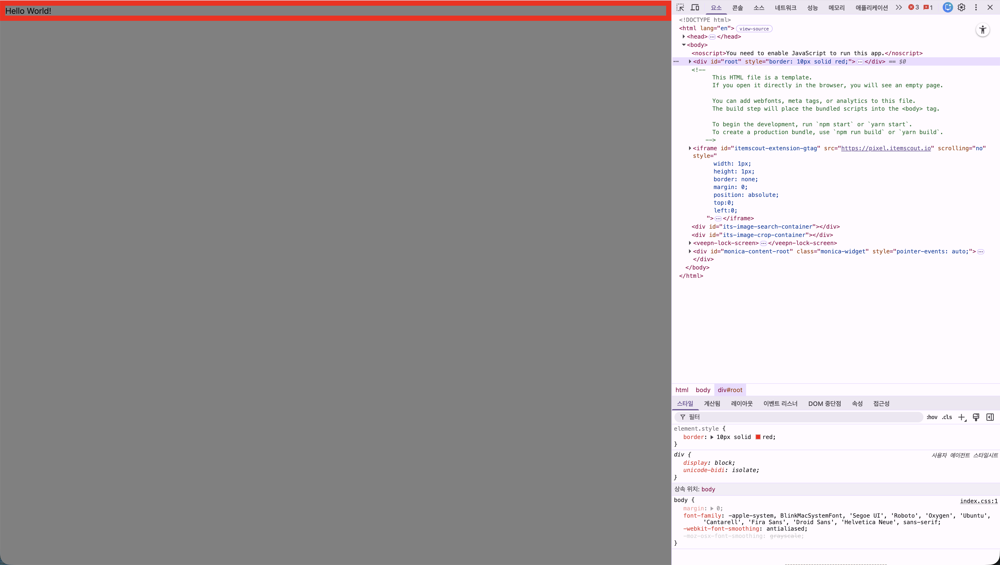
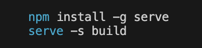
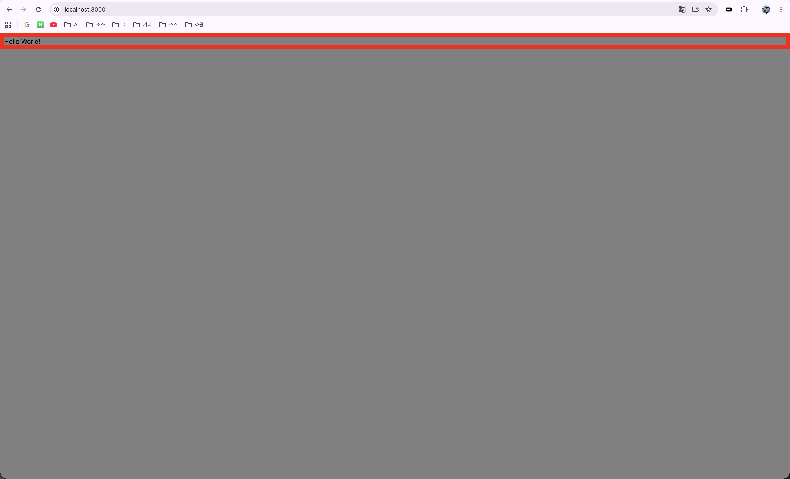

**실시간 미리보기 단축키: Command(⌘) + Shift(⇧) + V**. 

**화면 분할 미리보기: Command(⌘) + K를 누른 뒤 바로 V**. 


# 소스 코드 수정 방법. 
## src/index.js. 
일단 개발 환경을 설정하면 어떤 디렉터리 환경을 갖게 되는지부터 살펴보려면 가장 중요한 것은 **src**라는 폴더입니다.  
**src**폴더를 보면 **index.js**라는 파일이 있는데, 이 파일이 바로 입구 파일입니다.  
즉, **npm start** 명령어를 이용해서 Create React App을 구동하면 이 도구는 **index.jx**를 찾고, 이 파일에 적혀있는 대로 동작하게 되는 것입니다.  리액트 코드(App.js)를 index.html의 root 상자에 **집어넣어 주는 역할**을 함.
## src/App.js. 
**App.js** 파일의 내용을 편집해 가면서 UI를 만들어 가는곳입니다.  
사용자가 보는 화면 그 자체입니다. 글자를 쓰고, 이미지를 넣고, 버튼을 만드는 모든 작업이 여기서 일어납니다.  
화면에 Hello World를 찍고싶다!, 새로운 메뉴를 만들거나 내용을 바꿀 때 무조건 여기에서 수정합니다.  
## src/App.css. 
App.js에서 만든 요소들을 예쁘게 꾸며주는 곳입니다. 글자 색깔을 바꾸고 싶을 때(Color), 버튼을 둥글게 만들고 싶을 때(Border-radius), 레이아웃을 간격을 조절하고 싶을 때(Margin, Padding) 여기서 수정합니다.  
## index.html. 
우리 웹사이트의 진짜 대문입니다. 사이트 제목 &lt;title&gt;을 바꿀 때, 외부 폰트나 파비콘(아이콘) 넣을 때 사용합니다. 이 파일 안에는 &lt;div id="root"&gt;&lt;/div&gt;라는 빈 상자가 하나 있는데, 리액트가 만든 모든 화면이 이 상자 안으로 쏙 들어가는 방식입니다.  

## index.html 파일을 변경하고 리액트의 실행화면 확인
  

## 배포  
**npm run build** 명령어를 입력하면 빌드 명령이 시작됩니다. 참고로 배포판을 만드는 과정을 빌드라고 합니다. 빌드를 마치면 프로젝트에 build라는 폴더가 생기고, build 폴더에는 index.html을 의존하는 다른 파일들이 존재합니다. 실행한 결과를 보면 serve라는 앱을 사용하는 것을 추천하는 문구를 볼 수 있습니다. 이 serve는 웹 서버인데, 웹 서버가 가진 옵션 중에 -s 옵션을 추가하면 사용자가 어떤 경로로 들어오든 간에 index.html 파일을 서비스해주게 됩니다. 

  
*🔼 -s 옵션을 사용해서 빌드된 파일을 실행하는 모습*  

serve는 Node.js로 만들어진 애플리케이션이므로 serve를 간편하게 실행하고자 할 때는 npx를 사용하면 됩니다. 다음과 같이 명령어를 입력해 build 폴더에 있는 index.html을 서비스하는 웹 서버를 실행합니다.  
```java
npx serve -s build
```
명령어를 입력하면 접속할 수 있는 주소들이 나오는데, 여기서 첫 번째 주소인  http://localhost:3000으로 접속해보면 개발 환경을 위한 버전이 아닌 실제로 서비스해서 사용할 수 있는 버전이 만들어지고, 서비스된 모습을 볼 수 있습니다.  

*🔼 빌드를 완료한 리액트의 실행 화면 확인*  
