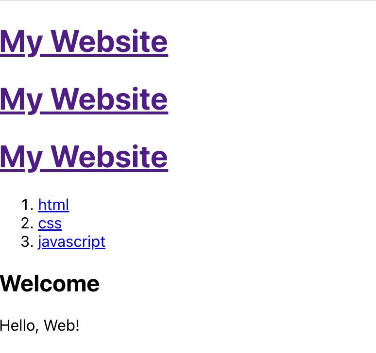
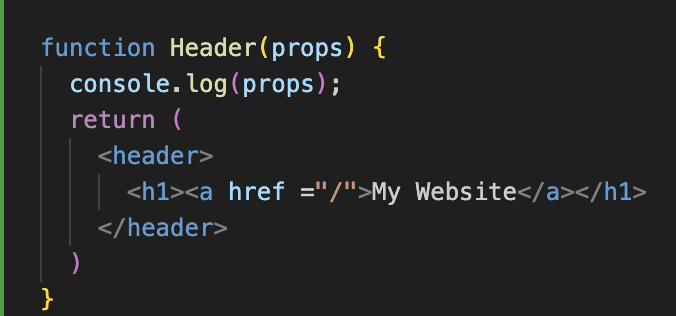
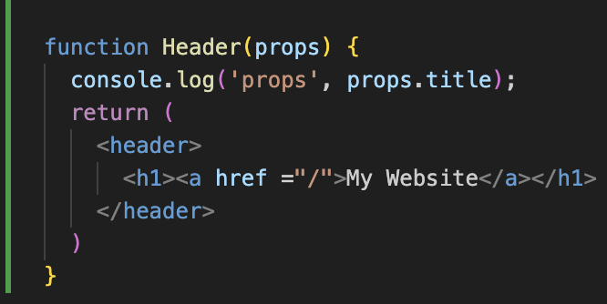
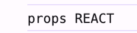
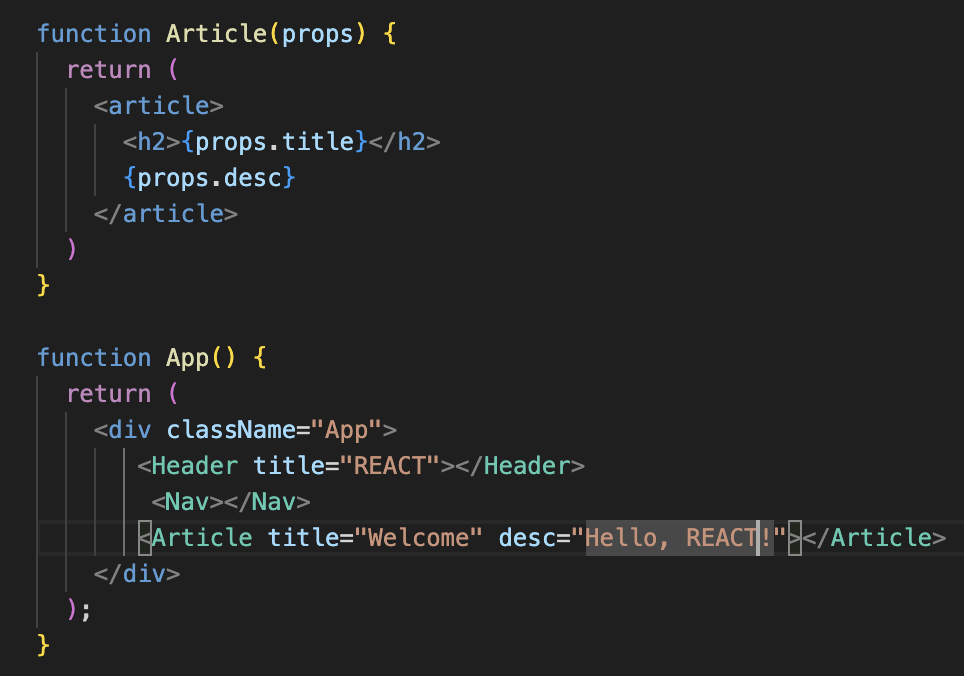

# 컴포넌트 만들기  
리액트는 사용자 정의 태그를 만드는 기술입니다. 이것이 리액트의 본질입니다.  
```java
<Header></Header>, <Nav></Nav>, <Article></Article>

<header>
    <h1>
        <a href="/">web</a>
    </h1>
</header>
<nav>
    <ol>
        <li><a href="/read/1">html</al><li>
        <li><a href="/read/2">css</al><li>
        <li><a href="/read/3">javascript</al><li>
    </ol>
</nav>
<article>
    <h2>Welcom</h2> 
    Hello, WEB
</article>               
```
*🔼 리액트는 사용자 정의 태그를 만드는 기술*  

상단에 있는 코드는 홈으로 이동하는 **헤더 영역**입니다. 그 다음 중간에 있는 코드는 HTML, CSS, javascript와 같은 구체적인 글을 볼 수 있는 페이지로 이동하기 위한 내비게이션 **영역**입니다. 마지막 코드는 본문을 표시하는 **아티클 영역**입니다.  


*🔼 간단한 HTML을 추가하고 실행한 결과 My Website=헤더 영역, [html,css,javascript]=내비게이션 영역, [Weclom Hello, Web!]= 아티클 영역*. 


리액트에서 사용자 정의 태그를 만들 때는 반드시 대문자로 시작해야 합니다.  
 
*🔼 코드를 효율적으로 바꿈*  

  
*🔼 그리고 헤더 부분을 2개 더 추가시킴*  

 
*🔼 Header 함수에서 My Website라고 돼 있던 부분을 Wow로 변경*  
Header함수에서 My Website라고 돼 있던 부분을 Wow로 변경하면 &lt;Header&gt; 태그를 사용하는 모든곳에서 My Website가 Wow로 바뀌는 폭발적인 효과를 경험할 수 있습니다.  
지금까지 사용자 정의 태그를 만들어 봤는데, 리액트에서는 사용자 정의 태그 대신에 컴포넌트라는 표현을 씁니다.  

  
*🔼 헤더 영역과 동일하게 상단에 Nav와 Article 컴포넌트를 만들어줌*  

이렇게 내비게이션 영역과 아티클 영역도 컴포넌트로 만들어 봤습니다. 당연히 결과도 똑같이 출력됩니다. 이전에 우리가 처음 가지고 있었던 코드와 비교하면 훨씬 더 보기 좋습니다. 각각의 코드가 이름을 갖고 있기 때문에 어떠한 취지의 코드인지도 금방 파악할 수 있습니다. 그리고 &lt;Article&gt; 컴포넌트를 사용하는 모든 곳에서 동시에 수정이 되는 폭발적인 효과를 얻을 수 있습니다.  
이것이 바로 리액트의 본질입니다. 이렇게 컴포넌트를 만드는 기술인 리액트 덕분에 여러 태그들을 하나의 독립된 부품으로 만들 수 있게 됐고, 이런 부품을 이용하면 더 적은 복잡도로 소프트웨어를 만들 수 있습니다. 동시에 내가 만든 컴포넌트를 다른 사람에게 공유할 수도 있고, 다른 사람이 만든 컴포넌트를 내가 만들고 있는 프로젝트에서 사용할 수도 있습니다. 컴포넌트를 재사용 함으로써 생산성을 획기적으로 끌어올리는 굉장히 중요한 역할을 하고 있습니다.

# props
리액트의 속성은 PROP라고 부릅니다.  
헤더 영역의 My Website라고 되어 있는 부분의 내용을 Header함수의 코드를 직접 변경하지 않고, &lt;Header&gt; 태그에서 title 속성의 값을 설정하면 설정한 값이 Header함수의 코드를 직접 변경하지 않고, &lt;Header&gt; 태그에서 title 속성의 값을 설정하면 설정한 값이 Hedaer 함수에 반영돼서 웹 페이지의 내용이 바뀌게 해보겠습니다.  

  
*🔼 Header 태그에 title props 추가*  
&lt;Header&gt; 태그는 위에 있는 function Header() 함수입니다. Header 함수에 첫 번째 파라미터를 추가하고, 이름은 props라고 지정합니다. 그리고 이 props에 어떤 내용이 있는지 console.log를 이용해 화면에 출력해보겠습니다.  

  
*🔼 Header 함수에 props 추가*  
브라우저에서 개발자 도구의 콘솔을 살펴보면 Hedaer 함수의 props 매개변수로 객체가 들어오는데, 이 객체는 title이 REACT라고 나와 있습니다.  

  
*🔼 콘솔에 출력된 props 살펴보기*  

그러면 이 REACT라는 텍스트를 얻어내려면 어떻게 하면 될까요? props.title이라고 하면 되지 않을까라고 생각을 해서 console.log에서 props를 props.title로 변경한 다음 실행해보았습니다.  


*🔼 Header 함수에 props 추가*  

  
*🔼 props.title로 전달받은 속성값*  
다음과 같이 REACT가 출력되었습니다.  
그렇다면 &lt;h1&gt;&lt;a href="/"&gt;My Website&lt;/a&gt;&lt;h1&gt;에 My Website 대신 props.title을 넣어주면 그 내용이 출력 되는지 보겠습니다.  

  
*🔼 My Website대신에 props.title로 넣기*  

  
*🔼 props.title이 그대로 출력됨*  
안 됩니다. 다음과 같이 props.title이 그대로 출력됩니다.  
return 문 안에서 props.title에 해당하는 값을 출력하려면 {props.title}과 같이 중괄호로 감싸줘야 합니다. {props.title}과 같이 **중괄호 {** 와 **중괄호 }**로 감싸주면 중괄호와 중괄호 사이에 있는 정보는 **일반적인 문자열이 아니라 표현식으로 취급**되고,표현식이 해석돼서 **props.title에 해당하는 값이 출력**됩니다.  

  
*🔼 {props.title}로 바꾸기*  

  
*🔼 {props.title}과 같이 중괄호로 감싸면 전달한 값이 출력됨*  

&lt;Article&gt; 태그에 title과 body props를 추가해서 한 번 해보겠습니다.  

  
*🔼 props.title을 중괄호로 감싸 표현식 만들기*  

  
*🔼 결과*  
당연히 잘 출력이 됩니다.