# 컴포넌트 만들기  
리액트는 사용자 정의 태그를 만드는 기술입니다. 이것이 리액트의 본질입니다.  
```java
<Header></Header>, <Nav></Nav>, <Article></Article>

<header>
    <h1>
        <a href="/">web</a>
    </h1>
</header>
<nav>
    <ol>
        <li><a href="/read/1">html</al><li>
        <li><a href="/read/2">css</al><li>
        <li><a href="/read/3">javascript</al><li>
    </ol>
</nav>
<article>
    <h2>Welcom</h2> 
    Hello, WEB
</article>               
```
*🔼 리액트는 사용자 정의 태그를 만드는 기술*  

상단에 있는 코드는 홈으로 이동하는 **헤더 영역**입니다. 그 다음 중간에 있는 코드는 HTML, CSS, javascript와 같은 구체적인 글을 볼 수 있는 페이지로 이동하기 위한 내비게이션 **영역**입니다. 마지막 코드는 본문을 표시하는 **아티클 영역**입니다.  

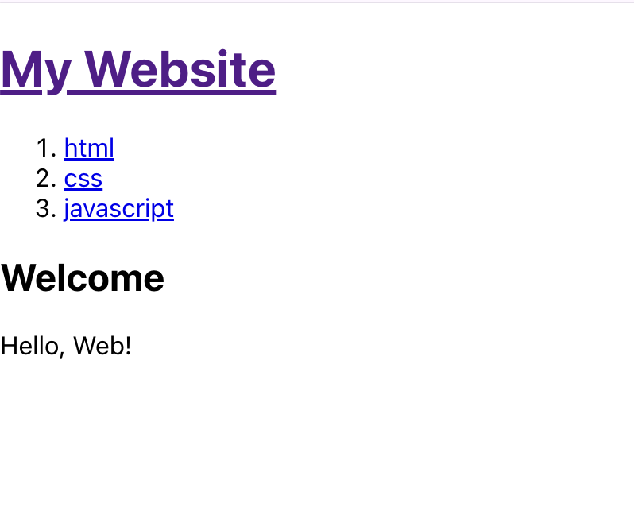  
*🔼 간단한 HTML을 추가하고 실행한 결과 My Website=헤더 영역, [html,css,javascript]=내비게이션 영역, [Weclom Hello, Web!]= 아티클 영역*. 

리액트에서 사용자 정의 태그를 만들 때는 반드시 대문자로 시작해야 합니다.  
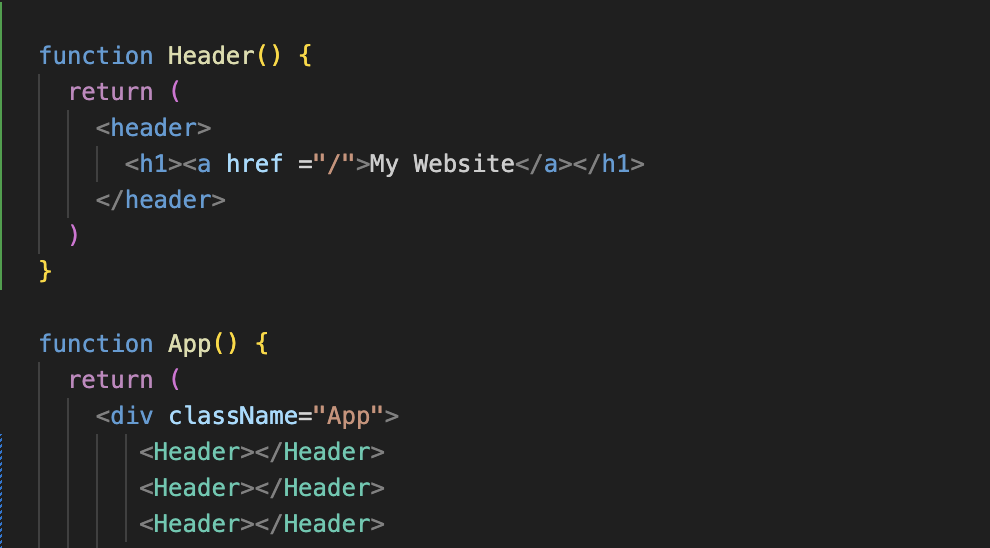  
*🔼 코드를 효율적으로 바꿈*  

  
*🔼 그리고 헤더 부분을 2개 더 추가시킴*  

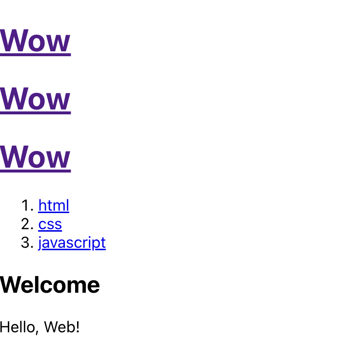  
*🔼 Header 함수에서 My Website라고 돼 있던 부분을 Wow로 변경*  
Header함수에서 My Website라고 돼 있던 부분을 Wow로 변경하면 &lt;Header&gt; 태그를 사용하는 모든곳에서 My Website가 Wow로 바뀌는 폭발적인 효과를 경험할 수 있습니다.  
지금까지 사용자 정의 태그를 만들어 봤는데, 리액트에서는 사용자 정의 태그 대신에 컴포넌트라는 표현을 씁니다.  

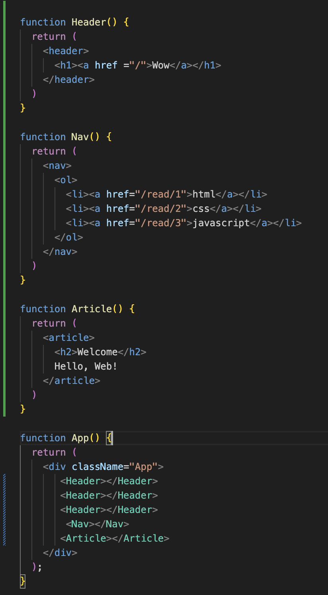  
*🔼 헤더 영역과 동일하게 상단에 Nav와 Article 컴포넌트를 만들어줌*  

이렇게 내비게이션 영역과 아티클 영역도 컴포넌트로 만들어 봤습니다. 당연히 결과도 똑같이 출력됩니다. 이전에 우리가 처음 가지고 있었던 코드와 비교하면 훨씬 더 보기 좋습니다. 각각의 코드가 이름을 갖고 있기 때문에 어떠한 취지의 코드인지도 금방 파악할 수 있습니다. 그리고 &lt;Article&gt; 컴포넌트를 사용하는 모든 곳에서 동시에 수정이 되는 폭발적인 효과를 얻을 수 있습니다.  
이것이 바로 리액트의 본질입니다. 이렇게 컴포넌트를 만드는 기술인 리액트 덕분에 여러 태그들을 하나의 독립된 부품으로 만들 수 있게 됐고, 이런 부품을 이용하면 더 적은 복잡도로 소프트웨어를 만들 수 있습니다. 동시에 내가 만든 컴포넌트를 다른 사람에게 공유할 수도 있고, 다른 사람이 만든 컴포넌트를 내가 만들고 있는 프로젝트에서 사용할 수도 있습니다. 컴포넌트를 재사용 함으로써 생산성을 획기적으로 끌어올리는 굉장히 중요한 역할을 하고 있습니다.

# props
리액트의 속성은 PROP라고 부릅니다.  
헤더 영역의 My Website라고 되어 있는 부분의 내용을 Header함수의 코드를 직접 변경하지 않고, &lt;Header&gt; 태그에서 title 속성의 값을 설정하면 설정한 값이 Header함수의 코드를 직접 변경하지 않고, &lt;Header&gt; 태그에서 title 속성의 값을 설정하면 설정한 값이 Hedaer 함수에 반영돼서 웹 페이지의 내용이 바뀌게 해보겠습니다.  

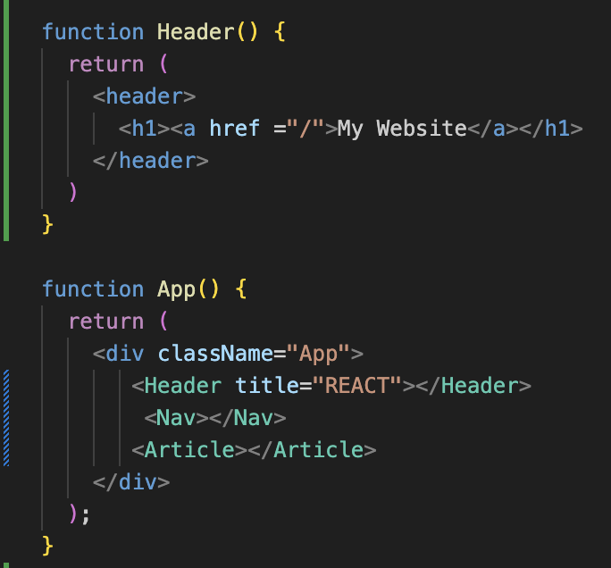  
*🔼 Header 태그에 title props 추가*  
&lt;Header&gt; 태그는 위에 있는 function Header() 함수입니다. Header 함수에 첫 번째 파라미터를 추가하고, 이름은 props라고 지정합니다. 그리고 이 props에 어떤 내용이 있는지 console.log를 이용해 화면에 출력해보겠습니다.  

  
*🔼 Header 함수에 props 추가*  
브라우저에서 개발자 도구의 콘솔을 살펴보면 Hedaer 함수의 props 매개변수로 객체가 들어오는데, 이 객체는 title이 REACT라고 나와 있습니다.  

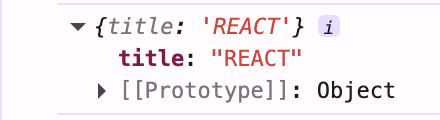  
*🔼 콘솔에 출력된 props 살펴보기*  

그러면 이 REACT라는 텍스트를 얻어내려면 어떻게 하면 될까요? props.title이라고 하면 되지 않을까라고 생각을 해서 console.log에서 props를 props.title로 변경한 다음 실행해보았습니다.  


*🔼 Header 함수에 props 추가*  

  
*🔼 props.title로 전달받은 속성값*  
다음과 같이 REACT가 출력되었습니다.  
그렇다면 &lt;h1&gt;&lt;a href="/"&gt;My Website&lt;/a&gt;&lt;h1&gt;에 My Website 대신 props.title을 넣어주면 그 내용이 출력 되는지 보겠습니다.  

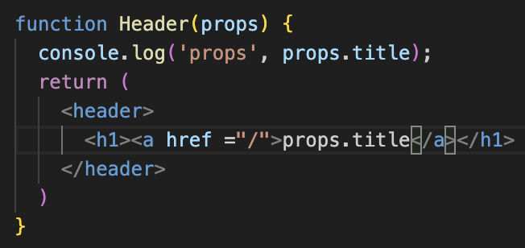  
*🔼 My Website대신에 props.title로 넣기*  

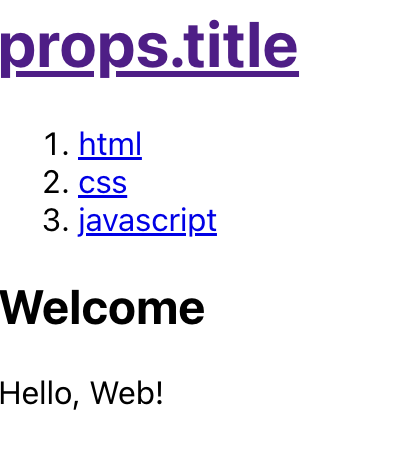  
*🔼 props.title이 그대로 출력됨*  
안 됩니다. 다음과 같이 props.title이 그대로 출력됩니다.  
return 문 안에서 props.title에 해당하는 값을 출력하려면 {props.title}과 같이 중괄호로 감싸줘야 합니다. {props.title}과 같이 **중괄호 {** 와 **중괄호 }**로 감싸주면 중괄호와 중괄호 사이에 있는 정보는 **일반적인 문자열이 아니라 표현식으로 취급**되고,표현식이 해석돼서 **props.title에 해당하는 값이 출력**됩니다.  

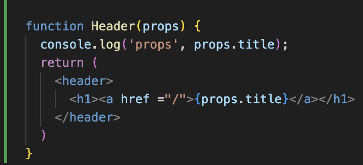  
*🔼 {props.title}로 바꾸기*  

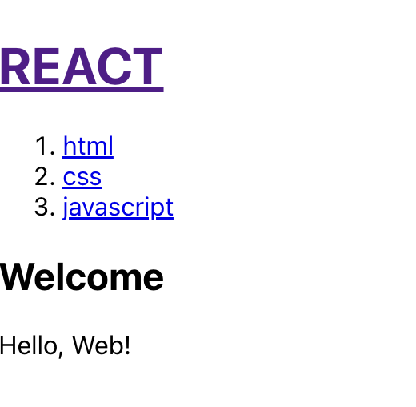  
*🔼 {props.title}과 같이 중괄호로 감싸면 전달한 값이 출력됨*  

&lt;Article&gt; 태그에 title과 body props를 추가해서 한 번 해보겠습니다.  

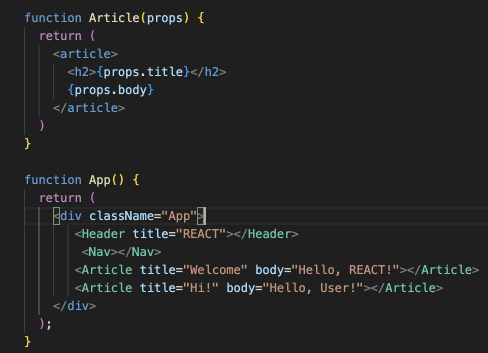
*🔼 props.title을 중괄호로 감싸 표현식 만들기*  

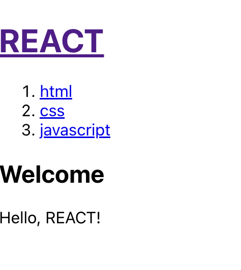  
*🔼 결과*  
당연히 잘 출력이 됩니다. 이렇게 처리하면 &lt;Article&gt; 태그가 언제나 똑같이 동작하는 것이 아닌 title 속성과 body 속성값에 따라 다른 결과가 출력되는 모습을 볼 수 있습니다.  
이번에는 내비게이션 영역을 살펴보겠습니다. 내비게이션 영역을 보면 목록이 있습니다. 이 목록을 함수에서 직접 입력하는 하드코딩 방식이 아닌 목록 역시 props를 이용해 props로 주입된 값에 따라 &lt;li&gt;가 구성된다면 얼마나 좋을까요??  
이렇게 하기 위해서는 내비게이션 목록에 있는 정보를 자바스크립트의 자료 구조에 맞게 변경해야 합니다. 예로 topics라는 변수를 만들겠습니다. topics 변수는 함수 안에서는 바뀌지 않기 때문에 const로 선언했습니다. const로 선언하면 topics의 값을 나중에 변경할 수 없기 떄문에 코드가 더 튼튼해집니다. topics의 값은 여러개이므로 배열에 담아주겠습니다.    

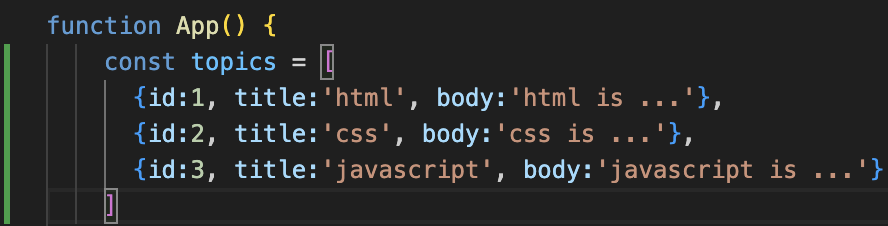  
*🔼 내비게이션의 목록을 담을 topics 변수 선언후 topics 변수에 html, css, javascript 정보를 담은 객체 추가*  

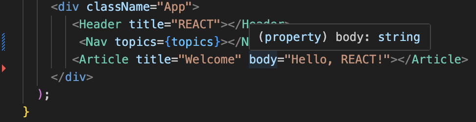  
*🔼 까먹지 말고 중괄호로 감싸줌*  

이제 Nav 함수에서 props 매개변수를 추가해 topics를 받아보겠습니다. 그리고 &lt;li&gt; 태그에 정보를 넣어주면 되는데, 이에 앞서 먼저 이해해야 할 게 있습니다. 다음과 같이 lis라는 배열을 만들고, &lt;li&gt; 태그로 구성했던 각각의 태그를 배열에 담아주겠습니다.

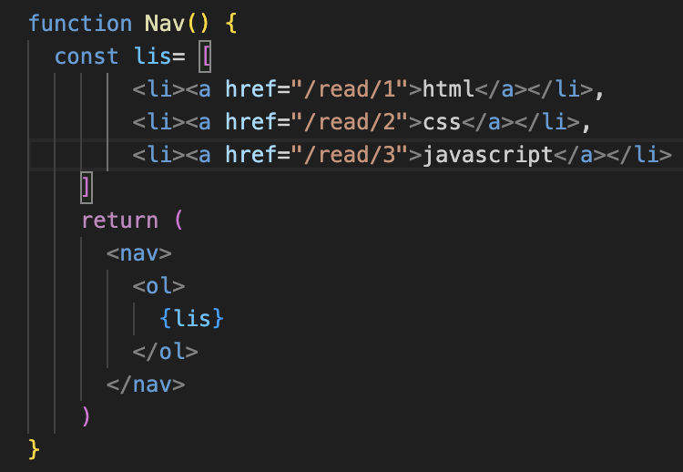  
*🔼 topics를 props로 전달*  
이렇게 배열에 담은 내용을 &lt;ol&gt; 태그에서 풀어헤치려면 어떻게 해야 할까요? 배열을 풀어헤치고자 하는 곳에 {lis}와 같이 배열을 넣어주면 리액트가 배열의 원소를 하나씩 꺼내서 &lt;ol&gt; 태그 안에 배치해주고, 기존과 똑같은 코드가 됩니다.  
하지만 이 자체로는 아무런 쓸모가 없고, props로 전달된 topics를 받아서 동적으로 &lt;li&gt; 태그를 구성 한 다음 배열에 담아줘야 합니다. 이때 사용할 수 있는 여러 방법이 있고, app을 많이 사용하는데, app은 조금 어려우니 단순한 for 문을 활용해보겠습니다.  

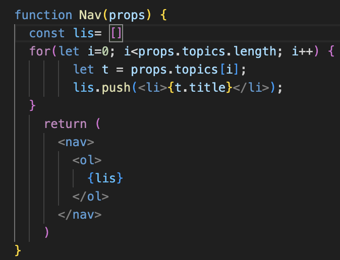
*🔼 내비게이션 영역을 props로 구성*  
다음과 같이 반복문을 구성합니다. 이렇게 구성하면 topics에 담긴 원소의 숫자만큼 반복될 것입니다. 반복되는 요소에 t라는 이름을 부여했고, &lt;li&gt;{t.title}&lt;li&gt;과 같이 요소를 구성한 다음 push를 이용해 lis 배열에 담았습니다.

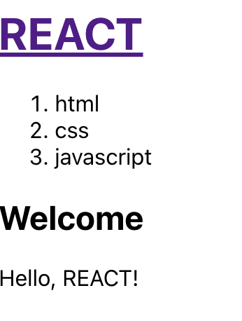  
*🔼 props로 구성한 내비게이션*  
이제 새로고침 해보면 리스트가 만들어지는 모습을 볼 수 있습니다.  

리스트를 링크로 만들기 위해 &lt;a&gt; 태그로 감싸겠습니다. 그다음 href 속성을 추가하고, href 속성 역시 동적으로 바뀌어야 하므로 중괄호로 감싸 구성하겠습니다.  

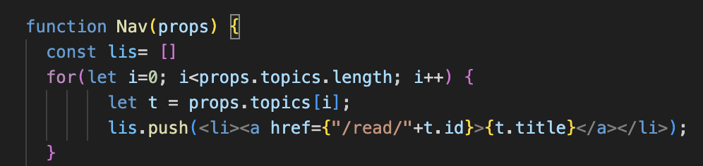  
*🔼 리스트를 링크로 만들기*  
이제 화면 빈 공간에서 마우스 오른쪽 버튼을 누른 다음 [검사]를 누르면 개발자 도구가 나옵니다. 개발자 도구에서 [Console] 탭을 누르면 환경이 동작하는 여러가지 정보를 볼 수 있는데, 새로고침을 해 보면 'Each child in a list should have a unique "key" prop'이라는 에러 메시지를 볼 수 있습니다.  

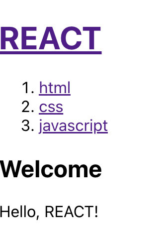  
*🔼 링크로 변환된 list* 

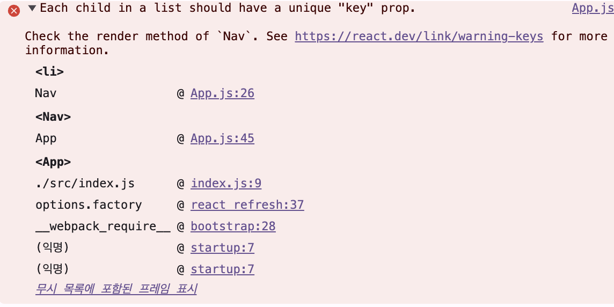  
*🔼 개발자 도구의 콘솔앱에 출력되는 에러 매시지*  
앞서 동적으로 만든 각각의 &lt;li&gt; 태그는 key라는 props를 가지고 있어야 하고, key라는 props의 값은 반복문 안에서 고유(unique) 해야 한다고 나와 있습니다. 따라서 다음과 같이 key props를 추가하고, 이 값은 고유해야 하므로 값을 t.id로 설정하겠습니다. 참고로 key 값은 애플리케이션 전체에서 고유하야 하는 것이 아닌 반복문 내에서만 고유하면 됩니다.  

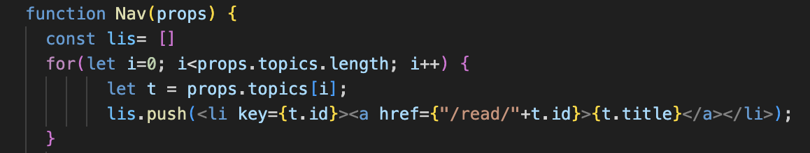  
*🔼 &lt;li&gt; 태그에 key props 추가*  
새로고침 해보면 앞서 발생했던 에러가 더는 발생하지 않는 모습을 볼 수 있습니다. 이 key 값을 설정하는 이유를 자세히 설명하는 것은 복잡합니다. 그냥 자동으로 생성하는 태그의 경우 리액트가 태그들을 추적해야 하는데, 이렇게 추적해야 할 때는 근거가 있어야 하고, 그 근거로써 key라는 약속된 prop을 부여한다고 이해하면 되겠습니다. 이렇게 함으로써 리액트가 성능을 높이고 정확한 동작을 할 수 있게 협조하는 것입니다.