# 이벤트  
``` 
<input type="button" onclick="alert('hi')"> 
```
여기에 있는 HTML을 보면 onclick이 있습니다. 이 onclick 덕분에 사용자는 버튼을 클릭했을 때 경고창을 띄울 수 있습니다.  
오늘은 Day02에서 만든 컴포넌트에 이벤트 기능이 있어서 컴포넌트에서 어떤 일이 발생했을때 사용자가 추가적인 어떤 작업을 처리할 수 있도록 만들어 볼겁니다.  

일단 onChangeMode라는 props의 값으로 함수를 전달하고, 이 &lt;Header&gt; 컴포넌트 안에서 링크를 클릭하면 컴포넌트가 함수를 호출해서 헤더를 클릭했을 때 해야하는 작업들을 실행하고 싶습니다.  

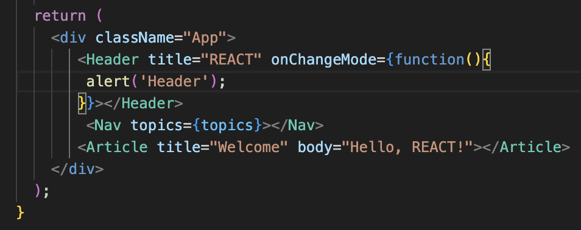. 
*🔼 Header 컴포넌트에 onChangeMode props 추가*  
그러면 &lt;Header&gt; 함수는 어떻게 바꿔야 할까요? Header 함수에 있는 &lt;header&gt; 태그를 보면 &lt;a&gt; 태그가 있는데, 이 &lt;a&gt; 태그에 onClick 이벤트를 추가하겠습니다. 이 &lt;a&gt; 태그는 순수한 HTML과 똑같지않고, 유사 HTML입니다. 따라서 Header 함수 안에 코드를 작성하면 리액트 개발 환경이 최종적으로 브라우저가 이해할 수 있는 HTML로 변환해주는 것이기 때문에 여기에서 사용하는 문법은 순수한 HTML과 똑같지 않습니다.  
onClick 뒤에 큰 따옴표를 쓰지 않고 다음과 같이 함수를 씁니다. 이렇게 하면 &lt;a&gt; 태그를 클릭했을 때 onClick 뒤에 있는 함수가 호출됩니다.  

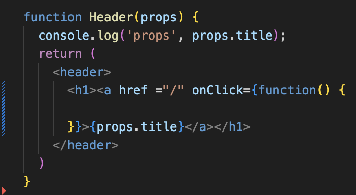. 
*🔼 Header 함수의 &lt;a&gt; 태그에 onClick 이벤트 추가*  
기본적으로 &lt;a&gt; 태그를 클릭하면 페이지가 이동되는데, 페이지가 이동되지 않도록 하려면 어떻게 해야 하는지 살펴보겠습니다. onClick 이벤트에 콜백 함수로 들어간 함수가 호출될 때 리액트는 event 객체를 첫 번째 파라미터로 주입합니다. 이 이벤트 객체는 이벤트 상항을 제어할 수 있는 여러가지 정보와 기능이 들어가 있는데, 다음과 같이 코드를 작성하면 &lt;a&gt; 태그가 동작하는 기본 동작을 방지해줍니다.  

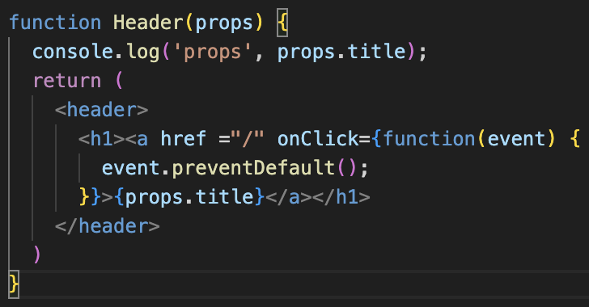. 
*🔼 &lt;a&gt; 태그의 기본 동작을 방지하는 코드 추가*  
실행해보면 기본 동작을 방지했기 때문에 &lt;a&gt; 태그를 클릭해도 페이지가 이동하지 않는 모습을 볼 수 있습니다.  
그다음에 해야 할 일은 onClick의 함수가 호출됐을 때 Header에 props로 전달된 onChangemode가 가리키는 함수를 호출하는 것입니다. 다음과 같이 코드를 추가하면 props.onChangeMode()는 &lt;Header&gt; 컴포넌트에 있는 onChangeMode를 가리키고, 이 함수가 호출됩니다.  

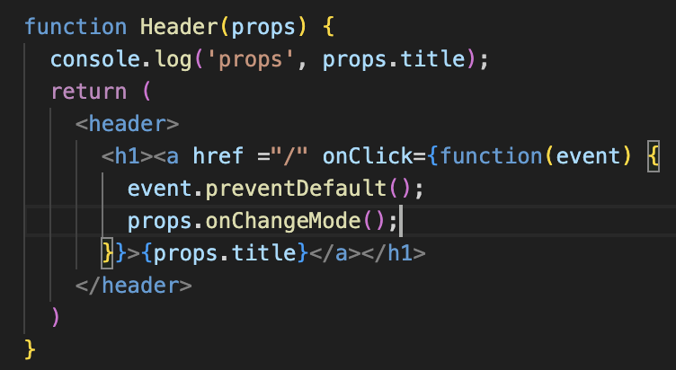  
*🔼 props로 전달한 onChangeMode 호출*  
이제 헤더 영역에 있는 REACT를 클릭하면 Header 경고창이 출력되는 모습을 볼 수 있습니다.  

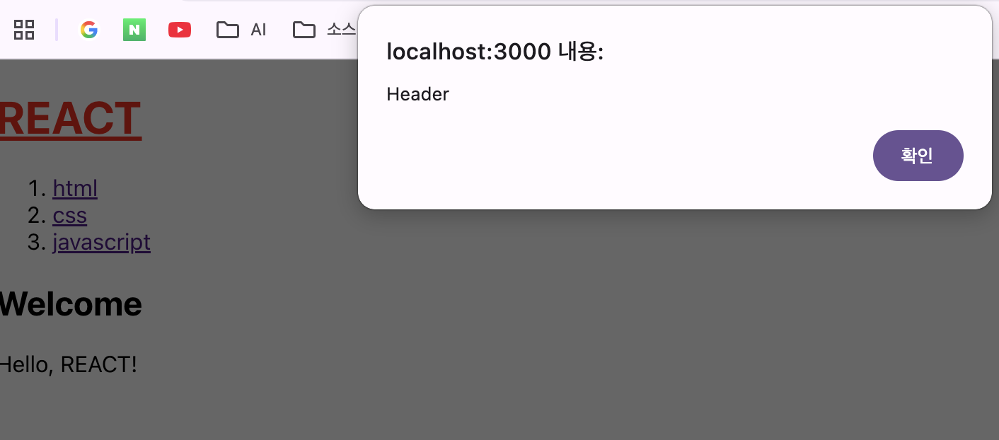  
*🔼 헤더 영역에 있는 링크를 클릭하면 나오는 Header 경고창*  


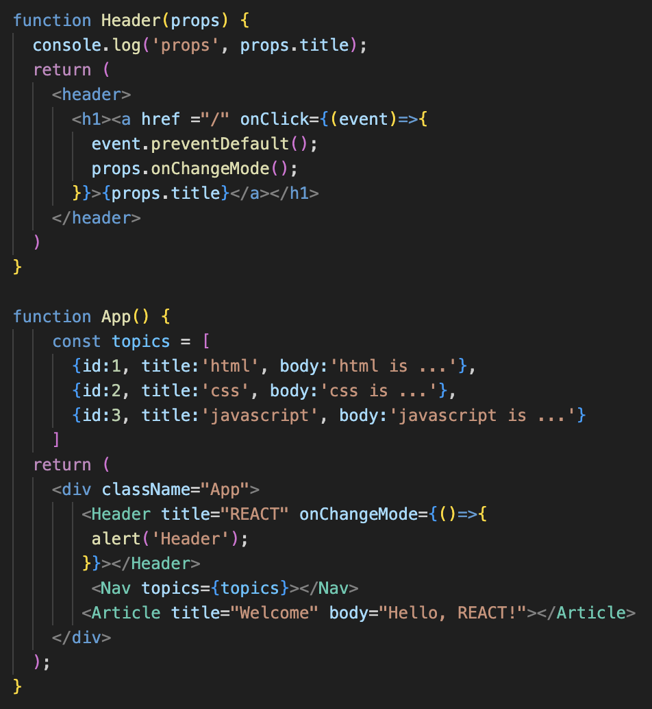  
*🔼 화살표 함수를 이용해 코드를 축약*  
&lt;Header&gt; 컴포넌트와 Header 함수에 있는 함수 문법이 조금 장황해서 화살표 함수를 이용해 축약해보겠습니다. 기존 코드와 똑같은 코드입니다.  

다음으로 할 일은 내비게이션 영역에 있는 목록을 클릭했을 때, css를 클릭하면 경고창에 2가 출력되고, javascript를 클릭하면 공고창에 3이 출력되게 해보겠습니다. 먼저 &lt;Nav&gt; 컴포넌트에도 onChangeMode props를 추가합니다. 이 props는 함수를 전달하는데, 함수의 첫 번째 파라미터로 id 값이 들어왔으면 좋겠습니다. 그리고 이 함수가 호출도리 때 id 값을 경고창으로 출력하고 싶습니다.  

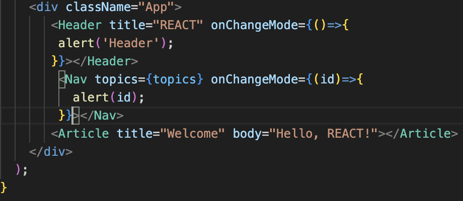. 
*🔼 &lt;Nav&gt; 컴포넌트에 onChangeMode props 추가*  
이제 Nav 함수를 구현하겠습니다. Nav 함수에 있는 &lt;a&gt; 태그를 클릭했을 때 이벤트가 발생하도록 하면될 것입니다. &lt;a&gt; 태그를 보기 좋게 줄 바꿈을 해서 높여 보겠습니다. 그리고 &lt;a&gt; 태그에 onClick 이벤트를 추가합니다. 참고로 파라미터가 하나일 때는 괄호를 생략할 수 있습니다. &lt;a&gt; 태그를 클릭했을때 기본 동작을 하지 않도록 event.preventDefault() 함수를 호출하고, &lt;Nav&gt; 컴포넌트의 onChangeMode를 호출합니다.  

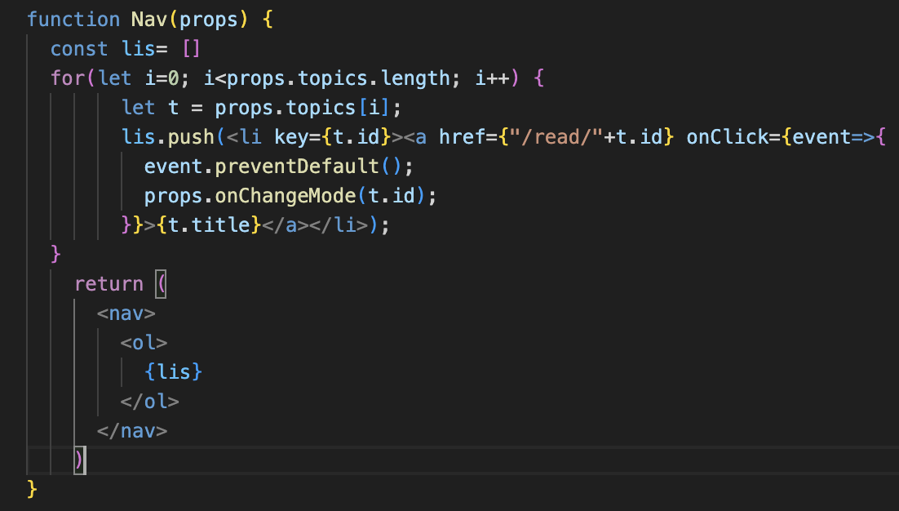  
*🔼 Nav 함수에 &lt;a&gt; 태그에 onClick 이벤트 추가*  
이때 onChangeMode는 id 값이 필요하므로 함수를 호출할 때 id 값을 주입해야 합니다. 이 id 값을 가져오는 방법으로 여러 방법이 있지만, 가장 쉬운 방법은 &lt;a&gt; 태그에 id={t.id}와 같이 id 값을 부여하는 방법입니다. 그러면 이벤트 함수 안에서 &lt;a&gt; 태그의 id 값을 얻으려면 어떻게 해야 할까요? 이때도 event 객체를 사용합니다. event.target이라고 하면 &lt;a&gt; 태그를 가리키게 됩니다. 여기서 target은 이벤트를 유발한 태그, 즉 &lt;a&gt; 태그를 의미합니다. 이 &lt;a&gt; 태그가 가지고 있는 id 값을 가져오기 위해 event.target.id와 같은 형태로 가져옵니다.  

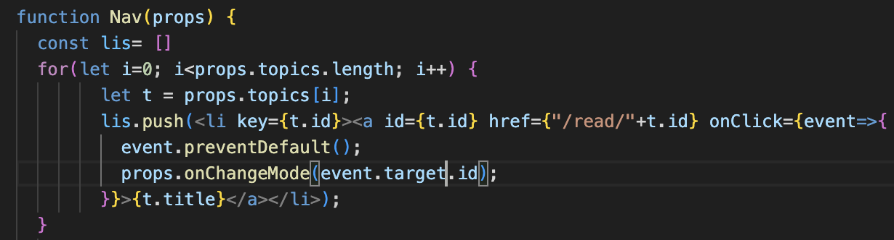. 
*🔼 onChangeMode로 id 값 주입*  

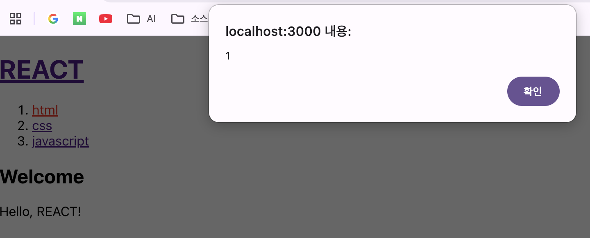  
*🔼 내비게이션 영역에 있는 링크를 클릭하면 나오는 경고창*  
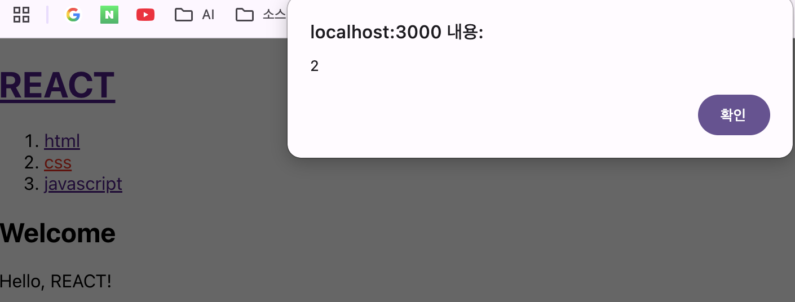  
*🔼 내비게이션 영역에 있는 링크를 클릭하면 나오는 경고창*  
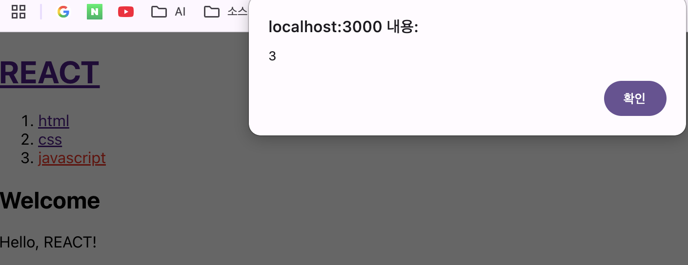  
*🔼 내비게이션 영역에 있는 링크를 클릭하면 나오는 경고창*  

잘 작동하네요. 👏👏👏  


# state  
지금부터 state라는 개념을 살펴보겠습니다. 리액트 컴포넌트는 입력과 출력이 있는데, 입력은 props입니다. prop을 통해서 입력된 데이터를 우리가 만든 컴포넌트 함수가 처리해서 return 값을 만들면 바로 그 return 값이 새로운 UI가 됩니다.  
prop과 함께 컴포넌트 함수를 다시 실행해서 새로운 리턴 값을 만들어주는 또 하나의 데이터가 있는데, 바로 이번 시간의 주인공인 state 입니다.  
prop과 state 모두 값이 변경되면 새로운 리턴 값을 만들어서 UI를 바꿉니다. 그런데 prop과 state의 차이점은 prop은 컴포넌트를 사용하는 외부자를 위한 데이터이고, state는 컴포넌트를 만드는 내부자를 위한 데이터라는 차이가 있습니다. 지금부터 state의 사용법을 알아보겠습니다.  

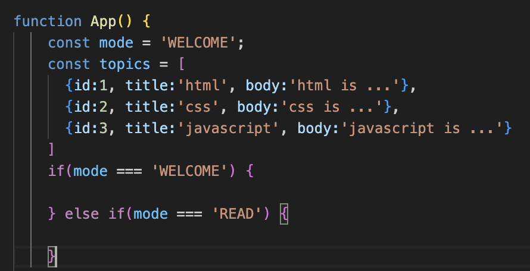. 
*🔼 mode라는 상수를 추가하고, mode에 따라 다르게 동작하는 조건문 작성*  
먼저 mode 라는 상수를 하나 만들겠습니다. 그리고 이 mode의 값이 무엇인지에 따라서 본문이 달라지게 하고 싶습니다. 다음과 같이 mode의 값이 WELCOME일 때와 mode의 값이 READ일 때의 처리를 다르게 하기 위한 조건문을 작성했습니다.  
이어서 content라는 변수를 하나 만들고, mode가 WELCOME일 때는 content가 웰컴 페이지가 되도록 &lt;Article&gt; 컴포넌트를 구성하고, mode가 READ일 때는 Read가 나오록 &lt;Article&gt; 컴포넌트를 구성합니다. 마지막으로 기존에 있던 &lt;Acticle&gt; 컴포넌트 부분에 content 변수가 출력되게 처리합니다.  

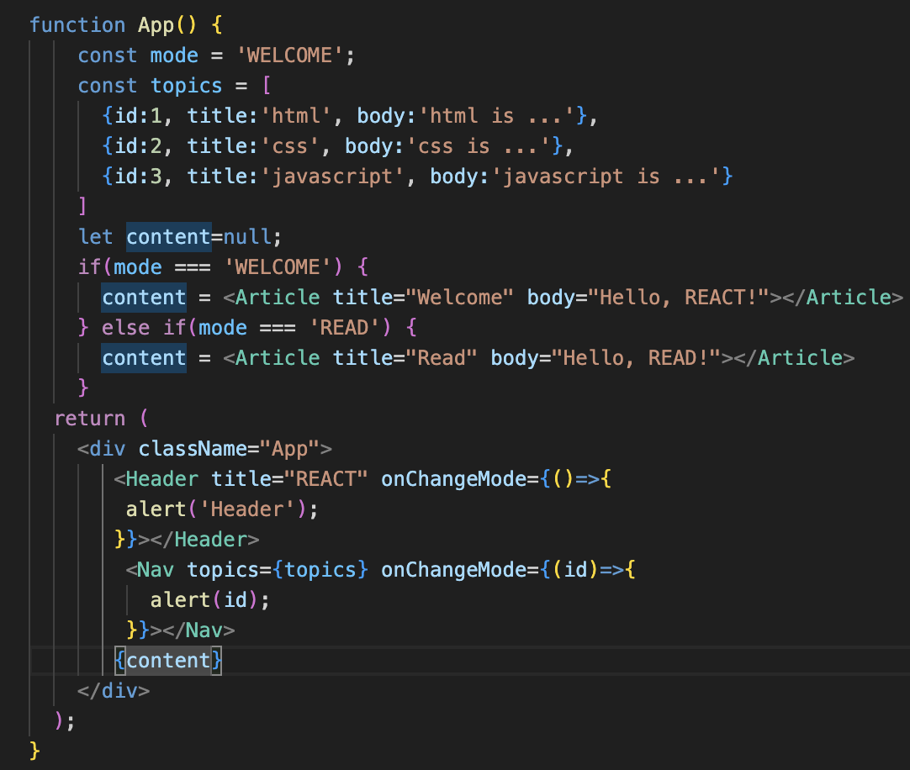. 
*🔼 mode에 따라 다르게 출력되도록 content 구성*  
저장하고 실행해보면 현재 mode가 WELCOME으로 설정돼 있기 때문에 Hello,REACT가 출력되는 모습을 볼 수 있습니다.  

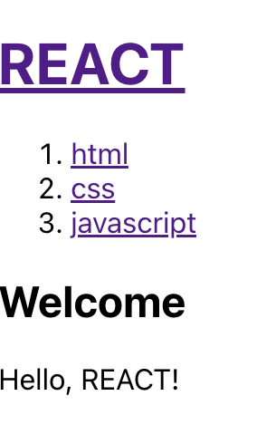  
*🔼 mode가 WELCOME일때 출력되는 모습*  

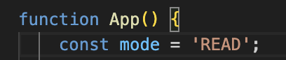  

*🔼 mode를 READ로 바꿔줌*  

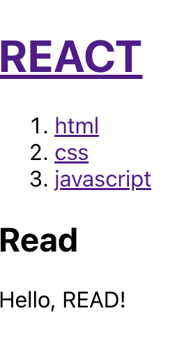  
*🔼 mode가 READ일때 출력되는 모습*  

다시 mode를 WELCOME으로 되돌려두겠습니다. 지금까지 애플리케이션의 논리를 구성했습니다.  
이제 우리가 해야 할 일은 이벤트가 발생했을 때 mode의 값을 변경하는 것입니다. &lt;Header&gt; 컴포넌트의 onChangeMode에서는 mode를 WELCOME으로 변경하고, &lt;Nav&gt; 컴포넌트의 onChangeMode에서는 mode를 READ로 변경하도록 다음과 같이 코드를 변경합니다.  

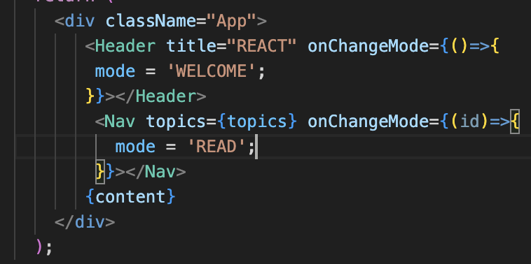  
*🔼 이벤트가 발생했을 때 mode의 값을 변경*  
현재 mode가 WELCOME 상태인데, 이 상태에서 내비게이션 영역의 html을 클릭하면 mode의 값이 READ로 바뀌고 UI가 바뀌겠죠? 하지만 예상했던 것과 달리 클릭해도 아무런 일이 생기지 않는 것을 볼 수 있습니다. mode의 값을 READ로 바꾸긴 했지만, 그렇다고 하더라도 App함수가 다시 실행되지 않기 떄문에 리턴 값에는 변화가 없는 것입니다.  
우리가 하고 싶은 것은 mode의 값이 바뀌면 컴포넌트 함수가 새로 실행되면서 새로운 리턴값이 만들어지고, 그 리턴 값이 UI에 반영되는 것을 꿈꾸고 있습니다. 이때 바로 state를 사용하면 됩니다. state를 사용하려면 먼저 임포트를 하고, useState라는 훅을 사용해야 합니다. 혹은 리액트에서 제공하는 기본적인 함수입니다.  

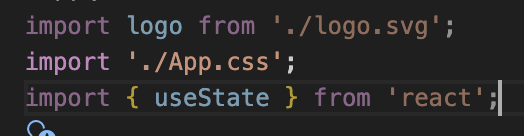. 
*🔼 state 임포트 추가*  

App 함수에 있는 mode는 일반적인 지역 변수인데, state(상태)로 업그레이드를 해야 합니다. 코드를 useState('WELCOME')와 같이 변경하면 상태가 됩니다. 상태를 만들면 이 상태가 리턴 될텐데, 이 리턴된 결과의 이름을 _mode라고 하겠습니다.  

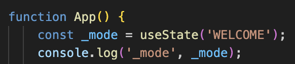. 
*🔼 mode를 state로 변경*  
개발자 도구를 켜고 콘솔을 연 다음 새로 고침을 해보면 _mode가 출력된 모습을 볼 수 있습니다. _mode의 0번째 원소에는 WELCOME이 담겨 있습니다. 그리고 1번째 원소는 함수입니다.  

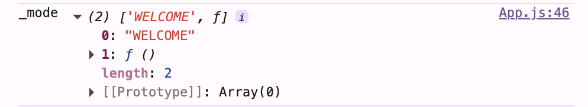  
*🔼 state 출력*  
다시 한번 정리하면 useState는 배열을 리턴하는데, 0번째 원소는 상태의 값을 읽을 때 쓰는 데이터이고, 1번째 데이터는 상태의 값을 변경할 때 사용하는 함수입니다. mode의 사용법을 조금 더 자세히 살펴보겠습니다.  

코드를 다음과 같이 작성하면 mode의 값을 통해서 상태(_mode)의 값을 읽어올 수 있습니다.
```
const mode = _mode[0];
```
그리고 코드를 다음과 같이 작성하면 1번째 원소인 setMode를 통해서 상태(_mode)의 값을 변경할 수 있다는 규칙이 있습니다.  
```
const setMode = _mode[1];
```
다시 한번 정리하면 useState의 인자는 그 state의 초깃값입니다. 그리고 state의 값은 0번째 인덱스의 값으로 읽고, state의 값을 변경할 때는 1번째 인덱스의 함수로 바꿉니다.  
앞서 작성한 코드가 조금 복잡한데, 이를 단순하게 다음과 같이 씁니다. 아래에 있는 한 줄의 코드가 앞서 살펴본 세 줄의 코드와 똑같은 코드입니다. 같은 문법이지만, 더 축약형이기 때문에 이 코드를 더 많이 사용합니다. 위에 있던 코드는 지워주겠습니다.  

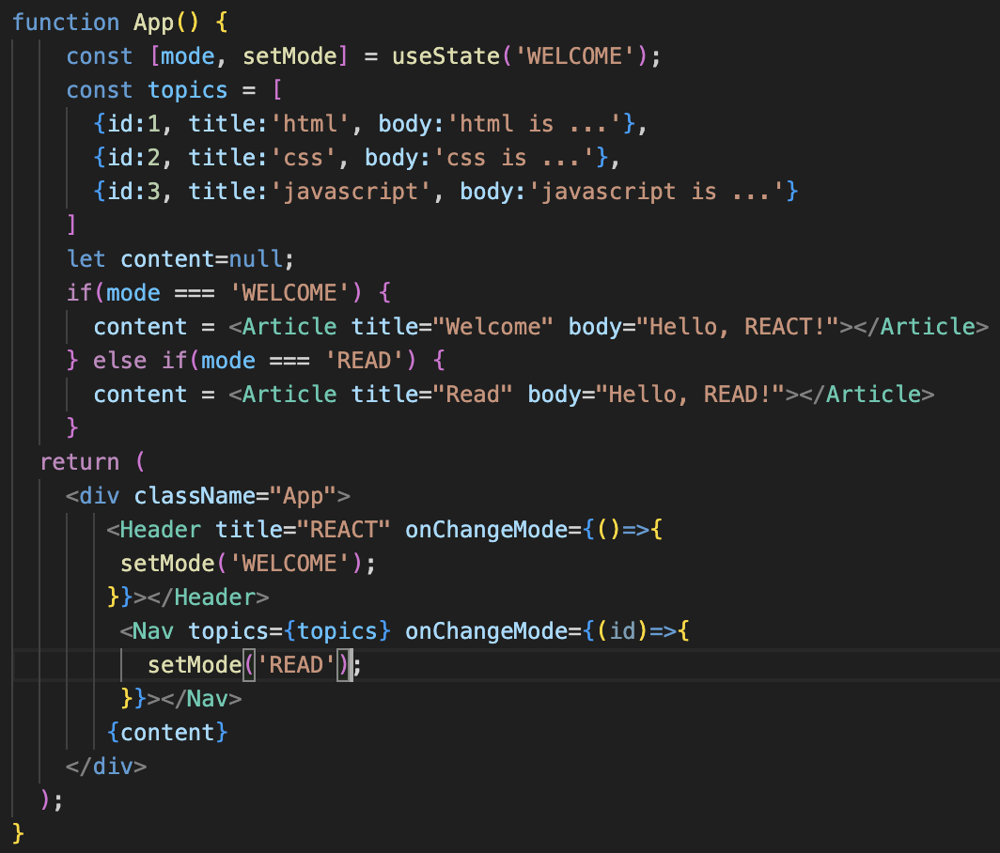. 
*🔼 state를 읽어오기 위한 mode와 변경하기 위한 setMode선언 setMode를 이용해 mode 값 변경*  
그럼 이제 mode 값은 그대로 사용하면 되므로 추가로 바꿔야 하는 부분은 없습니다. 그리고 onChangeMode에서 mode의 값을 바꿀때는 setMode를 사용해야 합니다. 이제 내비게이션 영역의 목록을 클릭해보면 아티클 영역이 READ로 변경되는 모습을 볼 수 있습니다.  
setMode로 인해 mode의 값이 READ로 바뀌면 App 컴포넌트가 다시 실행됩니다. 그러면서 useState가 mode의 값을 READ로 설정해주고, mode의 값이 READ이므로, content가 &lt;Article title="Welcom" body="Hello, Read"&gt;&lt;/Article&gt;로 바뀝니다. 그리고 바뀐 content가 화면에 렌더링되면서 Hello, Read를 불 수 있게 되는 것입니다.  

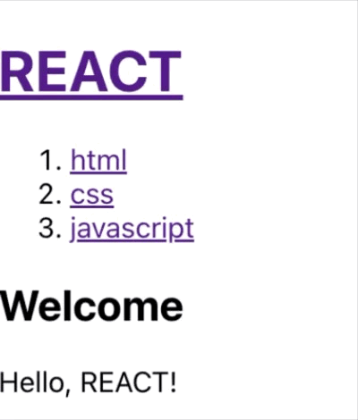  
*🔼 결과화면*  
지금까지 state를 만드는 방법을 살펴봤습니다. 그런데 글을 선택했을 때 Read로 나온다면 무슨 의미가 있겠어요. 우리가 선택한 글이 출력돼야겠죠? 그러기 위해서는 READ일때 content를 결정하는 다음 코드에서 제목과 본문이 적당한 값을 가지면 될 것입니다.  
```
content = <Article title = "Welcom" body="Hello, Read"></Article>
```
그렇게 하기 위해서는 어떤 글을 선택했는지 또한 state로 만들어야 합니다. 따라서 이름이 id인 state를 하나 추가하고, 현재 값이 선택되지 않은 상태이므로 초깃값을 null로 설정합니다.  

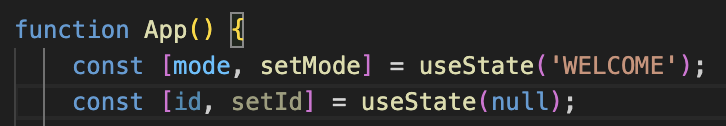  
*🔼 이름이 id인 state 추가*  
그리고 이 state 값은 내비게이션 영역의 목록을 클릭했을 때 바뀌어야 하므로 &lt;Nav&gt; 컴포넌트의 onChangeMode안에서 setId를 이용해 id값을 설정해줍니다. 그런데 id라고 하면 헷갈릴 수 있으므로 _id로 바꿔두겠습니다.  

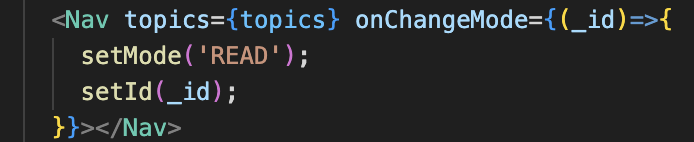  
*🔼 onChangeMode에서 setId를 이용해 id 값 설정*  
이제 Nav 컴포넌트에 있는 목록을 클릭하면 setId에 의해 id 값이 바뀌고, 컴포넌트가 새로 실행되면서 새로운 id 값이 지정됩니다. 그러면 그 id 값으로 우리가 무얼 하면 될까요? topics에 있는 값 중에서 우리가 선택한 id와 일치하는 원소를 찾아서 제목과 본문으로 설정하면 되겠죠?  
먼저 반복문을 반복하기에 앞서 title과 body의 값을 초기화합니다.