# Create
대부분의 애플리케이션은 이 네 가지 기능을 가지고 있습니다. 생성(Create), 읽기(Read), 수정(Update), 삭제(Delete). 그 중에서 우리는 읽기(Read) 기능을 이미 구현했고, 이번에 우리가 구현할 것은 생성(Create) 기능입니다. 

글을 생성하는 방법과 리액트에서 폼(Form)을 어떻게 다루는지 지금부터 살펴보겠습니다. 먼저 이번 시간에 우리가 구현할 애플리케이션이 어떻게 동작할지 미리 한 번 살펴보겠습니다. 우선 화면 하단에 Create 링크를 만들 것입니다.  

가장 먼저 생성 페이지로 이동하는 링크가 있어야 합니다. &lt;a&gt; 태그를 사용하고, href 속성을 /create로 지정했습니다. 이제 링크를 클릭했을 때 생성 페이지로 이동하면 되는데, 지금까지 실제 페이지로 이동하지 않고 어떻게 구현했나요? App에 잇는 mode의 값을 바꿈으로써 페이지를 바꾸고 있습니다. 그래서 Create 링크를 클릭하면 mode가 CREATE로 바뀌고, CREATE에 해당하는 UI가 나타나게 해보겠습니다.  

방금 생성한 &lt;a&gt; 태그에 onClick prop을 추가하고, 함수를 작성합니다. 이때 &lt;a&gt; 태그의 기본적인 동작을 하지 못하도록 event.preventDefault() 함수를 호출해 클릭했을 때 URL이 바뀌지 않도록 처리합니다. 그다음 mdoe값을 다음과 같이 CREATE로 변경합니다.  

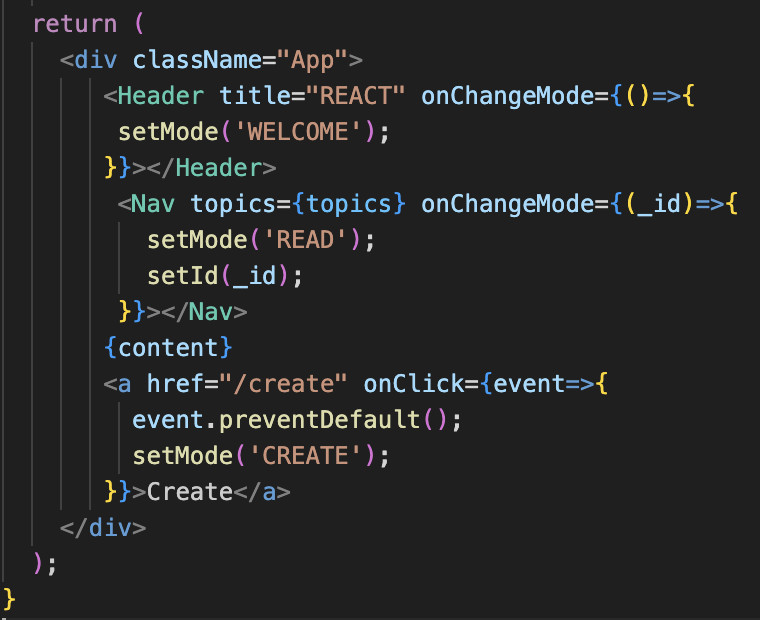  
*🔼 생성 페이지로 이동하는 링크 추가*  
setMode로 mode를 CREATE로 바꾸면, mode가 CREATE로 바뀌고, App 컴포넌트가 다시 실행될 것입니다. 그런데 if 조건문에서 WELCOME과 READ 아무것도 해당하지 않기 때문에 화면에 아무것도 출력되지 않을 것입니다.  

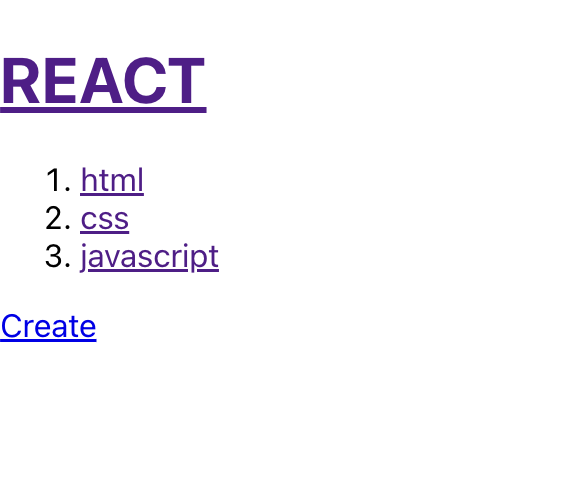  
*🔼 Create 링크를 추가해도 아무것도 표시되지 않음*  
따라서 else if 조건문을 추가하고, mode가 CREATE일 때 화면이 어떻게 바뀌어야 하는지 코드를 추가합니다. 이때 else if 문 안에서 UI를 다 만들어도 되겠지만, 생성 페이지는 꽤 복잡한 UI를 가지고 있기 때문에 별도의 컴포넌트로 만들겠습니다. 별도의 컴포넌트 이름은 &lt;Create&gt;로 지정하겠습니다.  

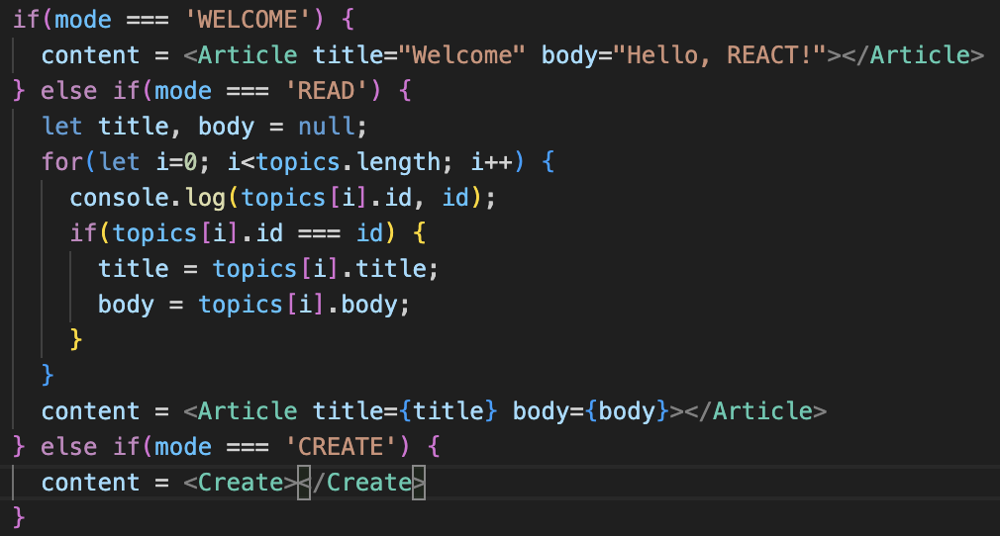. 
*🔼 mode가 CREATE일 때의 조건문 추가*  
이제 &lt;Create&gt; 컴포넌트를 만들어볼까요? Create 함수를 하나 추가하고 리턴 값을 다음과 같이 작성합니다. 최상위 태그는 &lt;article&gt;로 하겠습니다. 우리가 어떤 정보를 서버로 전송할 때 쓰는 HTML 태그는 뭔가요? &lt;form&gt; 태그입니다.  

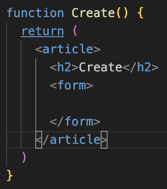. 
*🔼 Create 컴포넌트 만들기 - 제목 입력 폼*  
다음과 같이 &lt;form&gt;태그를 추가하고, &lt;form&gt; 태그 안에 입력하는 컨트롤들을 추가합니다. 텍스트를 입력할 때는 &lt;input type="text"&gt; 컨트롤을 사용하고, 이름(name)은 title로 지정했습니다. 그리고 사용자가 어떤 정보를 입력해야 하는지 안내하기 위해 플레이스홀더(placeholder) 속성을 title로 지정헀습니다. 플레이스 홀더를 지정하면 다음과 같이 입력 폼에 title이 나타나는 모습을 볼 수 있습니다. 그리고 이 입력 폼에 어떤 값을 입력하면 그때 title이 사라집니다.  

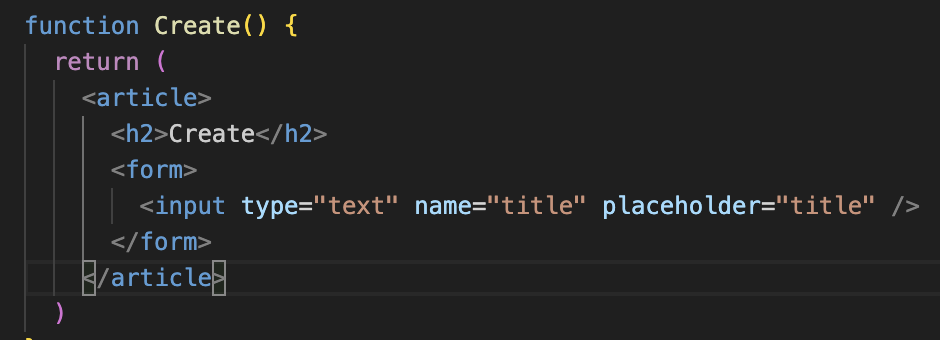. 
*🔼 Create 컴포넌트 만들기-제목입력 폼*  
그 다음 본문은 여러 줄을 표시해야 하는데, HTML에서 여러 줄을 표시할 때는 &lt;textarea&gt; 태그를 사용합니다. 이름(nmae)은 body로 지정하고, 플레이스홀더(placeholder)는 body라고 지정해서 본문을 입력하는 폼이라고 안내했습니다.  

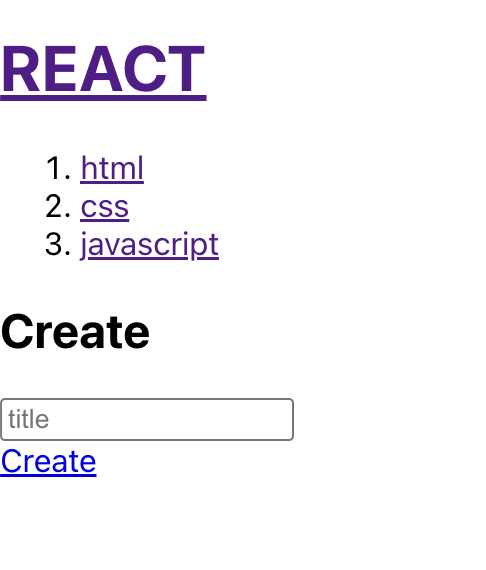  
*🔼 글 생성 페이지-제목입력 폼*  

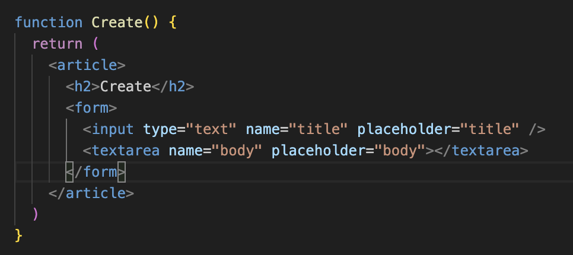
*🔼 Create 컴포넌트 만들기-내용 입력 폼*  

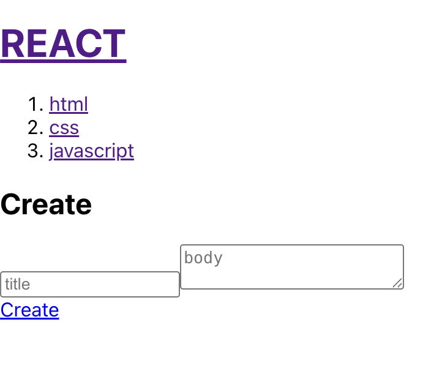  
*🔼 글 생성 페이지-내용입력 폼*  
하지만 이 상태로는 다음과 같이 요소들이 가로로 배치돼서 보기가 조금 안좋아요. 그래서 title과 body가 서로 다른 줄에 표시되도록 각각의 태그를 &lt;p&gt; 태그로 감싸주겠습니다.  

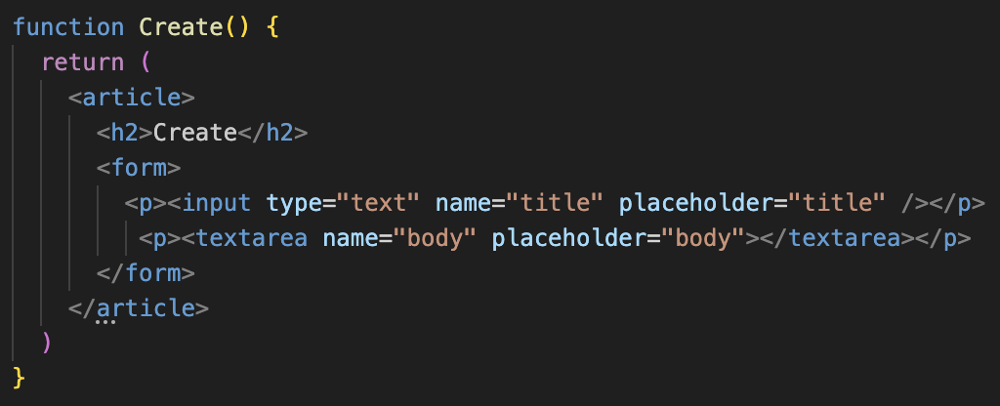. 
*🔼 Create 컴포넌트 만들기-&lt;p&gt; 태그로 감싸기*  

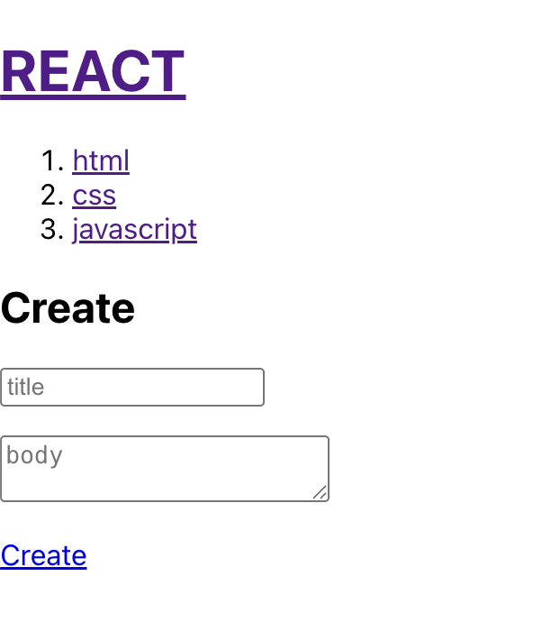  
*🔼 글 상세 페이지 완성*  
폼은 모두 완성했습니다. 그러면 Create 버튼을 눌렀을때 다음에 어떤 작업을 해야 할까요? 그다음에 저는 이렇게 생각해봤습니다. &lt;Create&gt; 컴포넌트를 이용하는 이용자가 생성(Create) 버튼을 눌렀을때 후속 작업을 할 수 있는 인터페이스를 제공하고 싶어요. 이런 식으로요.  

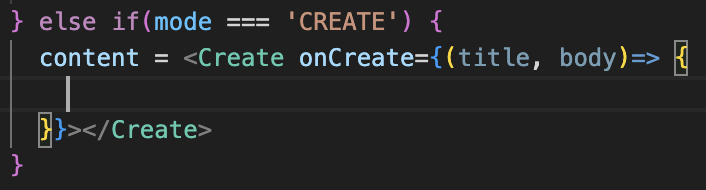. 
*🔼 Create 버튼을 눌렀을 때의 후속작업*  
onCreate prop에 함수를 전달하면 사용자가 Create 버튼을 눌렀을 때 이 함수가 실행될 거라고 사용자에게 고지 해야겠죠? 그때 이 콜백 함수는 title 값과 body 값을 받을 수 있어야 합니다. 그러면 onCreate를 어떻게 호출할 것이냐는 문제가 남을 것입니다. 
다시 Create 함수를 살펴보겠습니다. submit 버튼을 클릭했을 때 자바스크립트 코드가 실행되는 아주 좋은 타이밍 &lt;form&gt; 태그의 onSubmit이라고 하는 prop을 제공하는 것입니다.  

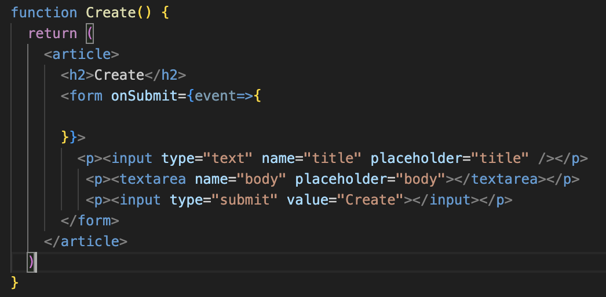. 
*🔼 &lt;form&gt; 태그에 onSubmit prop 추가*  
onSubmit은 submit 버튼을 클릭했을 때 form 태그에서 발생하는 이벤트입니다. 이 이벤트가 발생하면 어떤 일이 생기는지 살펴보겠습니다. title과 body를 입력하고 Create 버튼을 클릭하면 페이지가 리로드됩니다. 즉, form 태그는 submit을 했을 때 페이지가 리로드가 됩니다.  
페이지가 리로드 되는 것을 막으려면 어떻게 하면 될까요? 이때도 event 객체의 preventDefault() 함수롤 호출합니다.  

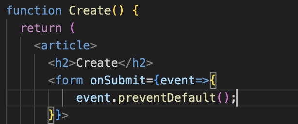  
*🔼 페이지가 리로드되는것을 방지*  
다시 Create 페이지에서 title과 body에 값을 입력하고 Create 버튼을 눌러보면 아무리 눌러 봐도 더 이상 페이지가 리로드되지 않는 모습을 볼 수 있습니다.  
그다음에 해야 할 일은 이 이벤트 함수 안에서 &lt;form&gt; 태그에 소속된 name 속성이 title이고, name 속성이 body인 태그의 value 값을 가져와야 합니다. 이때 title은 event 객체의 target을 통해서 접근 할 수 있습니다. event.target이라고 하면 이 이벤트가 발생한 태그를 가리킵니다. 그럼 누구일까요? Submit 버튼을 눌렀을 때 생긴 이벤트는 이 &lt;form&gt; 태그입니다. form 태그 안에 있는 name이 title인 태그는 이렇게 하면 간단하게 가져올 수 있습니다.  
event.target.title이라고 하면 &lt;input&gt; 태그를 가리키는 것이고, 태그의 값을 가져오려면 뒤에 value를 써야합니다. 그러면 title의 값(value)을 가져올 수 있습니다. 그렇다면 body는 어떻게 할까요? event.target.body.value라고 해서 가져올 수 있습니다.  

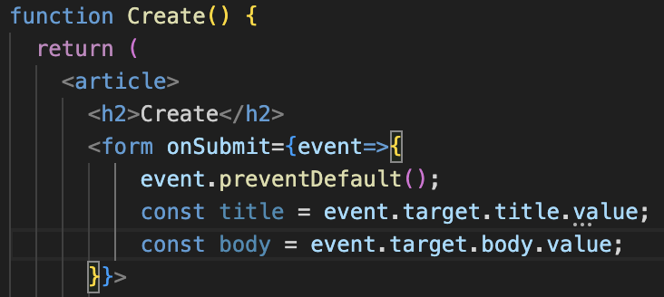. 
*🔼 폼에 입력한 제목과 내용 가져오기*  
이렇게 가져온 title과 body를 우리는 &lt;Create&gt; 컴포넌트의 사용자에게 공급하면 되겠죠? 그 사용자는 어떻게 Create 컴포넌트로부터 Submit 정보를 공급받아요? onCreate이죠. 이것은 prop입니다. 그래서 저는 Create 컴포넌트에 props를 추가하고, 이 props를 통해서 onCreate 함수를 호출할 것입니다. 이때 첫 번째 파라미터로는 title, 두번째 파라미터로는 body값을 줍니다.  

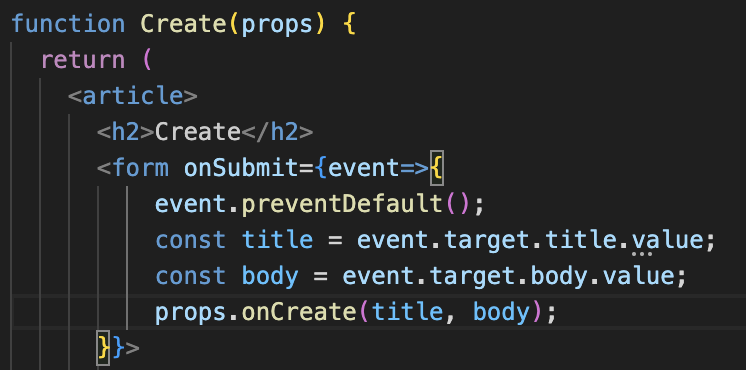. 
*🔼 props를 통해 onCreate 함수 호출*  
그럼 이게 실행이 되면 어떻게 될까요? &lt;Create&gt; 컴포넌트에서 onCreate가 가리키는 함수가 실행될 것이고, 그 함수의 title과 body 값을 통해서 사용자가 입력한 title과 body 값을 Create 컴포넌트의 사용자에게 공급할 수 있습니다.
```
content=<Create onCreate={(title, body)=>{


}}></Create>
```
여기에서  이제 우리가 해야 할 작업은 topics 변수에 새로운 원소를 추가해서 내비게이션 영역에 목록이 추가되게 하는 것입니다. 그 다음 스텝은 topics를 상태로 승격시키는 것입니다. topics를 useState로 감싸서 승격시키면 됩니다. 이때 topics는 읽을 때 사용하는 것이고, topics를 바꿀 때는 setTopics를 쓰도록 읽기와 쓰기의 인터페이스를 추가했습니다.  

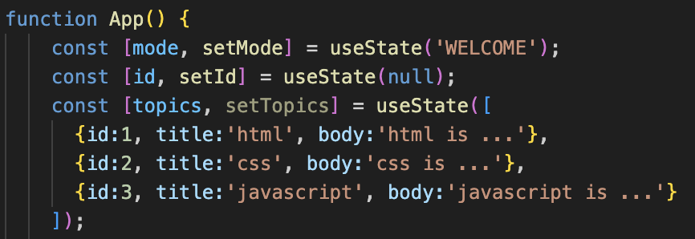. 
*🔼 topics를 state로 승격*  
이어서 topics에 들어갈 새로운 원소를 만들어야 합니다. 그 원소는 객체입니다. Create 컴포넌트에서 newTopics이라는 이름으로 객체를 하나 만들겠습니다. title은 _title, body는 _body로 지정합니다. 앞에 있는 title은 이 객체의 프로퍼티 이름이고, 뒤에 있는 _title은 파라미터로부터 온 이름입니다. 같은 이름으로 지정하면 헷갈릴 것 같아서 언더마(_)를 이용해 구분해 주었습니다.  

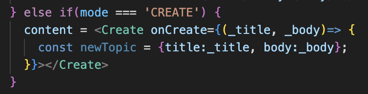  
*🔼 topics에 들어갈 새로운 원소 만들기*  
그런데 하나 빠진게 있죠? id 값은 어떻게 하면 좋을까요? 저는 id 값을 별도로 관리하겠습니다. 그래서 nextId라는 state를 만듭니다. 그리고 이 state의 초깃값을 지정합니다. 지금 topics에 담긴 마지막 원소의 id 값이 3이므로 다음에 생성되는 원소의 id 값은 4가 돼야하므로 4로 초깃값을 지정합니다. 이 nextId를 이용해 다음 원소의 id 값을 결정할 수 있습니다. 이제 이 값을 이용해 다음과 같이 id 값으로 사용합니다.  

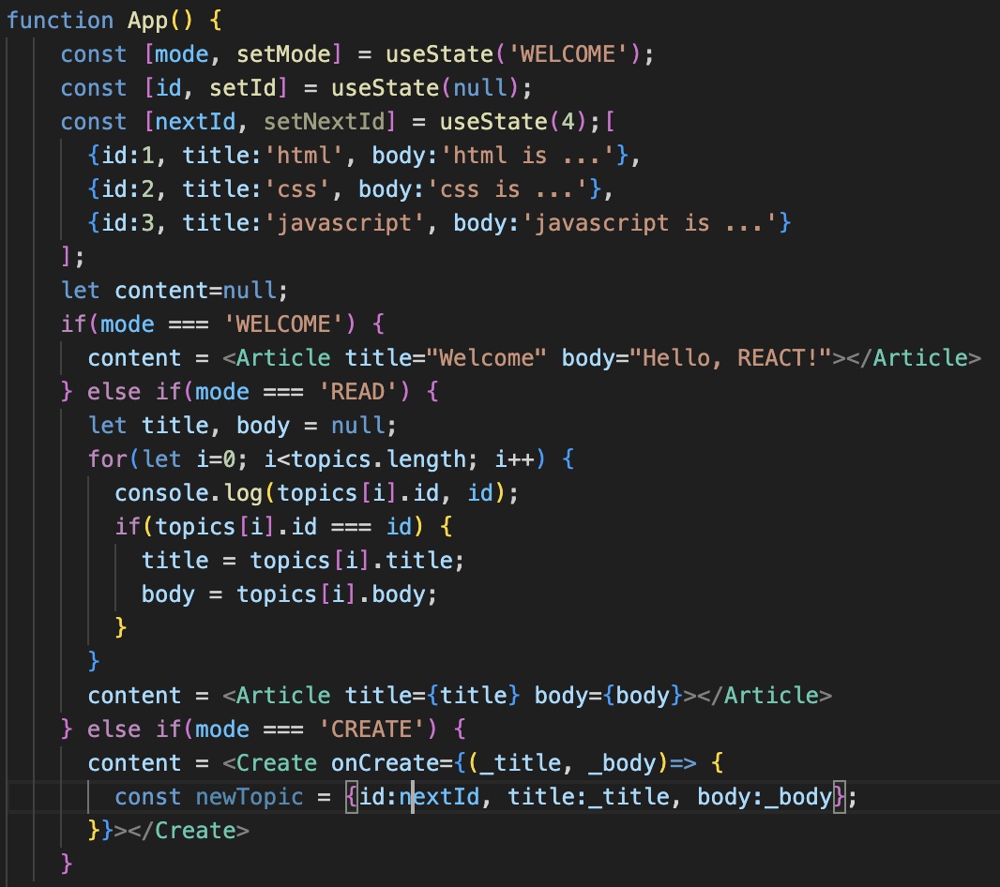  
*🔼 nextId state 추가*  
newTopic이 생겼습니다. 이 newTopic을 어떻게 하면 될까요? topics에 newTopic을 추가하면 될까요? 이건 state를 읽을 때 사용하는 것이기 땜누에 안되겠죠. setTopics를 써야합니다.  

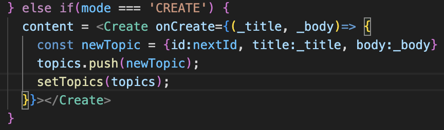. 
*🔼 setTopics로 topics로 newTopics를 추가*  
그럼 setTopics에 topics를 추가하면 될까요? 한번 해보겠습니다. Create 페이지에서 제목과 내용을 입력하고 [Create] 버튼을 누르면 아무일도 일어나지 않습니다.  

상태를 만들 때 상태의 데이터가 원시 데이터 타입(Primitive Type)이라면 옛날에 하던 방식 그대로 하면 됩니다. 참고로 원시 데이터 타입으로는 7가지 정도가 있는데, 그중 유명한 string, number, boolean 정도만 기억해주세요.
```
const[value, setValue] = useState(PRIMITIVE);
string, number, bigint, boolean, underfiend, symbol, null
```
그런데 상태로 만들려는 데이터가 원시 데이터 타입이 아닌 범 객체라면 처리 방법이 달라져야 합니다. 대표적인 범 객체로는 object, array와 같은 것들이 있습니다. 객체는 당연히 범 객체겠죠? 배열도 범 객체 안에 들어갑니다.
```
const[value, setValue]=useState(Object);
object, array
```
범 객체라면 다음과 같이 데이터를 복제해야 합니다. {...value}라고 하면 value 값을 복제한 새로운 데이터가 newValue의 값이 됩니다. 그리고 newValue의 값을 변경하는 것입니다. 오리지널 값을 변경하는 것이 아닌, 복제본을 바꾸고, 그러고 나서 setValue로 newValue를 넣어주면 그때 비로소 데이터가 다시 실행됩니다.
```
newValue={...value}
newValue 변경
setValue(newValue)
```
만약 데이터가 배열이라면 다음과 같이 대괄호와 점 세 개로 value를 복제하고, newValue를 변경한 다음 setValue를 호출하면 오리지널 데이터가 아닌 복제본 데이터를 변경한 것이고, 그때 비로소 컴포넌트가 다시 실행된다는 것입니다.
```
newValue=[...vauel]
newValue 변경
newValue(newValue)
```
그럼 우리의 코드는 어떻게 바꿔야 할까요? 우리의 데이터인 topics는 배열이므로 [...topic]으로 배열을 복제합니다. 그러면 topic을 복제한 복제본이 만들어집니다. 그리고 복제본을 push 해서 복제본을 바꾼 다음 setTopic으로 복제본을 전달하면 리액트는 오리지널 데이터인 topic과 새로 들어온 복제본이 서로 같은지 판단합니다. 만약 서로 다르면 그때 비로소 컴포넌트를 렌더링하는 것입니다.  

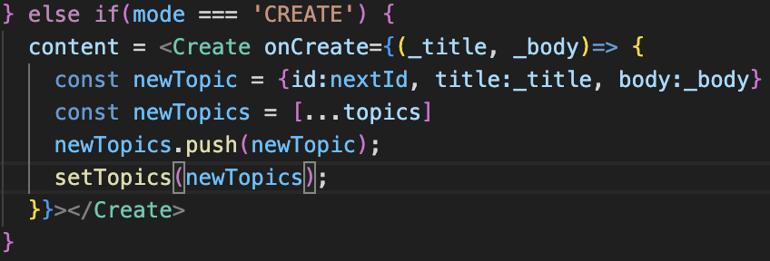. 
*🔼 배열을 복제한 다음 setTopic으로 복제본을 전달*  
그리고 실행해보면 제목과 내용을 입력하고 [Create] 버튼을 누르면 드디어 컴포넌트가 새로 렌더링되는 모습을 볼 수 있습니다.

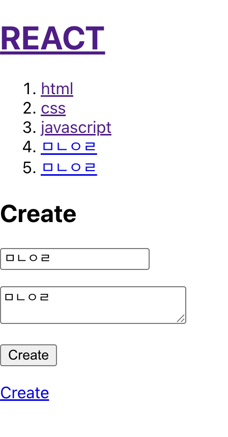  
*🔼 제목과 내용을 입력하고 생성 버튼을 누르면 추가되는 글*  
원리를 조금만 더 살펴보겠습니다.
배열이 있습니다. 배열로 만들어진 상태, 즉 객체입니다.
```
const[value, setValue] = useState([1]);
```
다음과 같이 코딩하면 오리지널 데이터를 바꾼 것입니다.
```
const[value, setValue]=useState([1]);
value.push(2);
setValue(value);
```
반면에 다음 데이터는 원시 데이터 타입을 쓰고 있죠?
```
const[value, setValue]=useState(1);
```
그리고 setValue를 하면 새로운 값이 됩니다. 오리지널 데이터는 여진히 1이고, 새로운 데이터는 이제 2이기 때문에 둘은 다른 데이터라서 컴포넌트가 다시 렌더링 되는 것입니다.
```
const[value,setValue]=useState(1);
setValue(2);
```
따라서 데이터가 범 객체라면 기존의 오리지널 데이터를 복제해서, 복제한 데이터를 변경하고, 변경한 데이터를 setValue 해야합니다.
```
const[value, setValue]=useState([1]);
newValue=[...value];
newValue.push(2);
setValue(newValue);
```
이것이 상태를 다룰 때 그 상태가 객체와 같이 복합적인 데이터인 경우에 처리할 수 있는 가장 간단한 지침이라고 생각합니다.

우리의 애플리케이션도 상세페이지로 이동하게 해보겠습니다. 글을 축하ㅏㄴ 뒤에 setMode를 READ로 바꾸면 됩니다. 그 다음 지금 우리가 추가한 글의 ID인 nextId를 setId로 지정하고, 다음에 글을 추가할 것을 대비해서 nextId를 현재 nextId보다 1을 더한 값으로 변경합니다.  

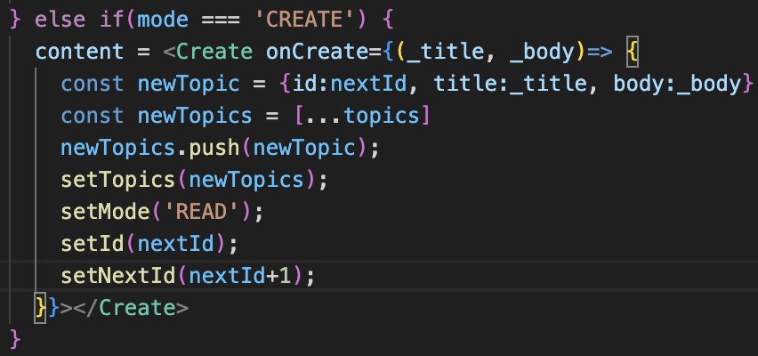. 
*🔼 글을 추가한 뒤에 추가한 글로 이동하기*  
다시 한번 제목과 글을 입력하고 [Create] 버튼을 클릭해 글을 생성해보면 다음과 같이 새로운 글이 추가되고, 추가된 글의 상세보기 페이지로 이동하는 모습을 볼 수 있습니다. 세련된 애플리케이션을 완성했습니다. 👏

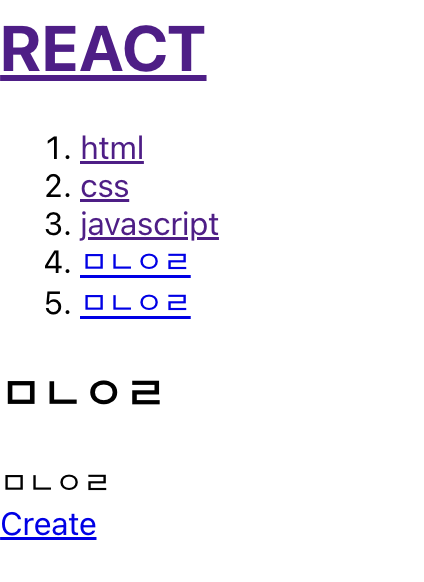  
*🔼 글을 추가한 뒤에 추가한 글로 이동하는 세련된 앱*. 