# update
오늘은 업데이트 기능을 어떻게 구현하는지 살펴보겠습니다. 업데이트는 생성과 읽기를 결합해서 구현합니다. 그래서 난이도는 상당히 높지만, 업데이트를 할 줄알면 CRUD는 모두 할 줄아는 거라고 해도 과언이 아닙니다.

제일 먼저 해야 할 일은 업데이트로 가는 링크를 추가하기 입니다. Create 링크 뒤에 &lt;a&gt; 태그를 다음과 같이 추가합니다.  

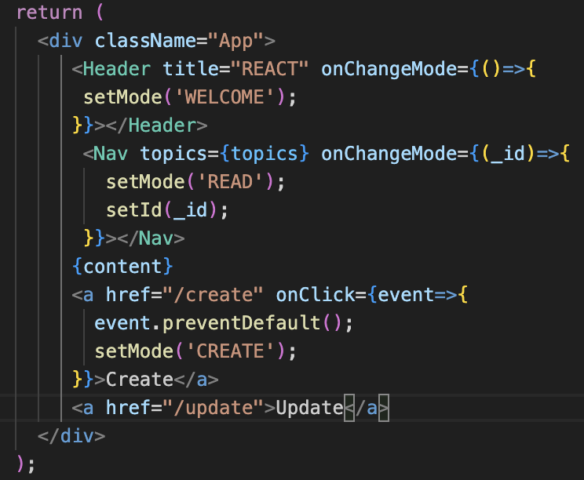. 
*🔼 수정하는 페이지로 이동하는 링크 추가* 

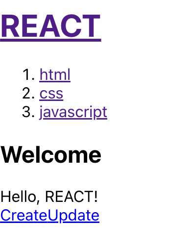  
*🔼 수정 페이지로 이동하기 위한 Update 링크*  
Update 링크를 추가했는데, 보기에 Create 링크와 Update 링크가 너무 붙어 있습니다. 그리고 Create와 Update는 둘 다 콘텐츠에 변화를 가하는 조작입니다. 그래서 Create 링크와 Update 링크를 각각 &lt;li&gt; 태그로 감사주겠습니다. 그리고 Create와 Update는 딱히 순서가 중요하지 않기 때문에 &lt;ul&gt; 태그로 감싸서 목록화하겠습니다.

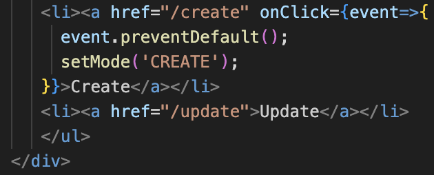. 
*🔼 Create 링크와 Update 링크를 목록으로 감싸기*. 

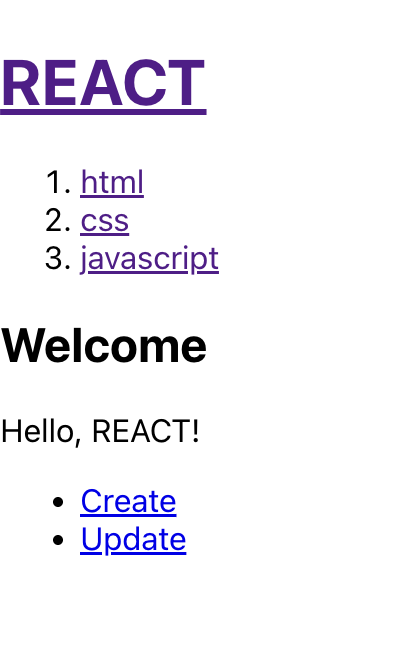  
*🔼 목록으로 감싼 Create 링크와 Update 링크*  
그다음에 글을 업데이트할 때는 업데이트하려는 대상이 있습니다. 예를 들어 예제에서 CSS는 id가 2번 입니다. 그래서 URL은 /update가 아닌 /update/2와 같이 어떤 글을 수정하는 것인지 나타내는 것이 더 우아할 것입니다. 물론 클릭해봤자 그 페이지로 이동하지는 않지만요. 이런 형식을 지켜주는 것도 중요할 수 있습니다.  
그리고 또 하나는 업데이트라는 이 기능은 상세보기 페이지로 들어갔을 때만 노출되고, Welcome 페이지에서는 안보이게 하는 것이 세련된 구현일 것입니다. 
우선 방금 추가했던 Update 링크를 잘라내겠습니다. 그리고 contextControl이라는 지역변수를 만들겠습니다. 맥락적으로 만들어지고, 노출되는 UI라는 뜻에서 ContextControl이라고 이름을 붙였습니다. 그래서 이 컨트롤은 moderk READ일 때에만 나오게 하고 싶습니다. 그래서 modeRK READ인 if문 안에서 contextControl을 추가하고, 앞서 잘라낸 Update 링크를 붙여 넣습니다. 이제 이 contextControl을 &lt;ul&gt; 목록 안의 &lt;li&gt;에 추가합니다.  

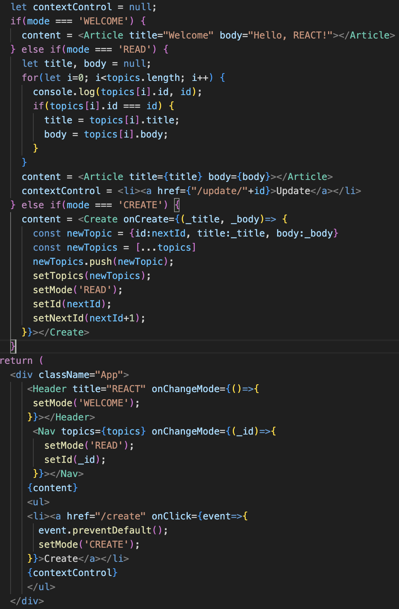. 
*🔼 글의 상세 보기 페이지에서만 Update 링크 표시하기*  
이렇게 하면 사용자가 홈페이지로 갔을 때는 Updateㄹ이크가 표시되지 않고, 상세보기 페이지로 가면 Update가 표시됩니다. 왜 그럴까요? mode가 READ일 때에만 contextControl이 세팅되기 때문이죠.  

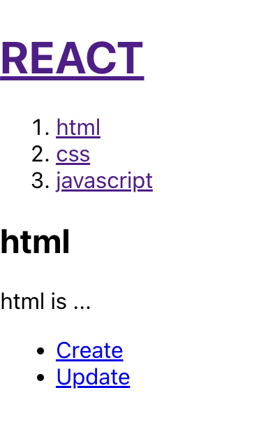  
*🔼 글의 상세 보기 페이지에서만 표시되는 Update 링크*  
그리고 또 하나는 Update 링크를 클릭했을 때 Update의 고유한 ID가 있을 것입니다. 이 ID를 주소에 표시해주면 더 좋을 것입니다. 주소를 표시해주기 위해 contextControl의 /update/ 뒤에 id 값을 추가합니다.  

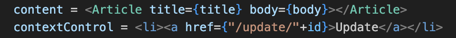  
*🔼 Update 링크에 글의 id 표시하기*  

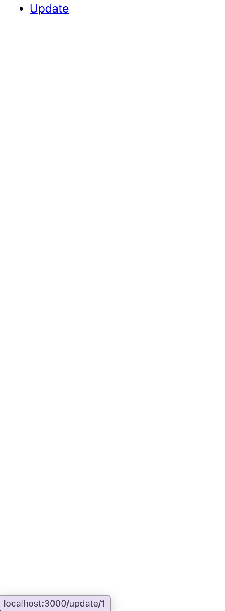  
*🔼 Update 링크에 ID 값 추가*  

그리고 Update를 클릭했을 때는 Create와 똑같습니다. &lt;a&gt; 태그에 onClick prop을 추가하고, 함수를 작성합니다. 먼저 클릭을 막아야 하므로 event.preventDefault() 함수를 호출합니다. 그리고 setMode로 mode 값을 Update로 변경해 Update로 이동하게 합니다.  

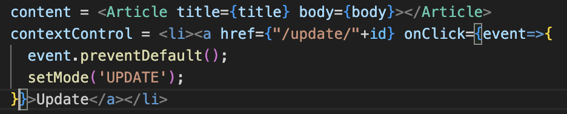. 
*🔼 Update 링크에 onClick prop 추가*. 
그러면 어디로 이동하나요? mode가 UPDATE일 때 어떻게 동작해야 하는지 코드를 작성해야 하므로 mode가 UPDATE인 else if 문을 추가합니다. 그리고 else if 문 안에서는 content로 Update 컴포넌트가 출력되게 하겠습니다.  

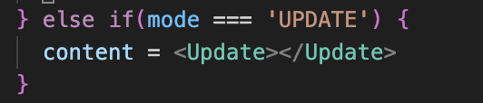. 
*🔼 mode가 UPDATE일 때의 else if 문 추가*. 
그럼 이어서 Update 컴포넌트의 내용을 구현해보겠습니다. 우선 Update 함수를 만듭니다. Update는 Create와 거의 똑같으므로 Create 함수의 코드를 복사한 다음 붙여 넣겠습니다.  

 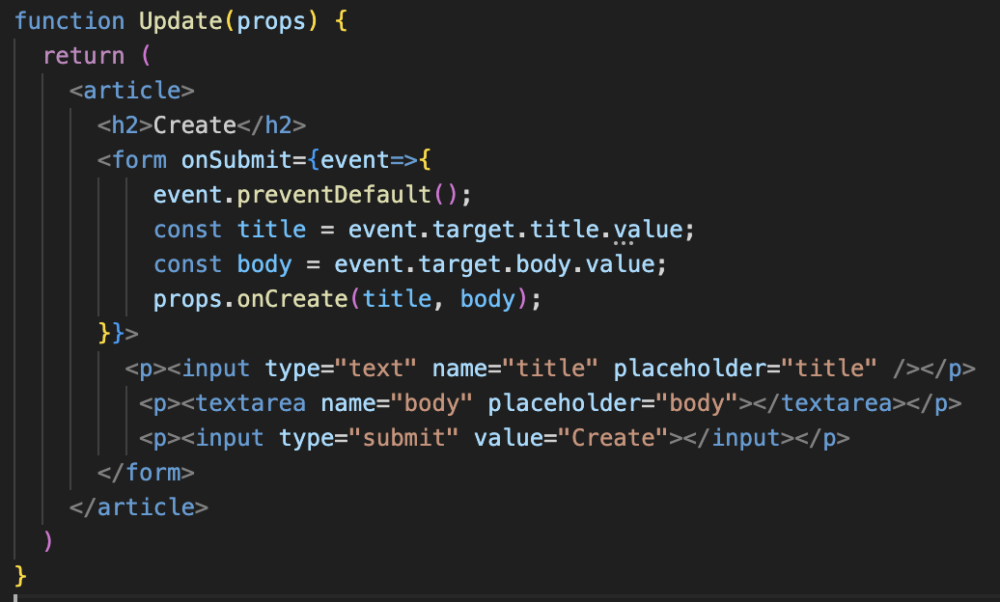. 
 *🔼 Update 함수를 만들고 Create 함수를 복사하여 붙여넣기*.  
 화면을 살펴보면 에러가 발생하는데, 에러 메시지를 보면 'props' is note defined, 즉 props가 정의돼 있지 않다고 나와 있습니다.

 onCreate를 호출하는데, Update 컴포넌트는 props가 없기 때문에 에러가 발생하고 있습니다. 따라서 우선 props를 추가하겠습니다.
 ```
 function Update(props) {

 } 
 ```
 그리고 Update 함수를 보면 onSubmit이 됐을 때 props로 onCreate를 하고 있는데, 이번에는 글 생성이 아닌 수정을 할 것이므로 onUpdate로 변경하겠습니다.
 ```
 props.onUpdate(title, body);
 ```
그 다음 화면에 출력된 제목과 버튼 이름이 Create로 돼 있는데, 이 부분을 우선 Update로 변경합니다. Update 컴포넌트에서 &lt;h2&gt; 태그의 제목과 submit 버튼의 value를 Update로 바꿔줍니다.
```
<h2>Update</h2>
...생략...
<p><input type="submit" value="Update"></input></p>
```
지금까지 작성한 코드를 정리해보면 다음과 같습니다.  

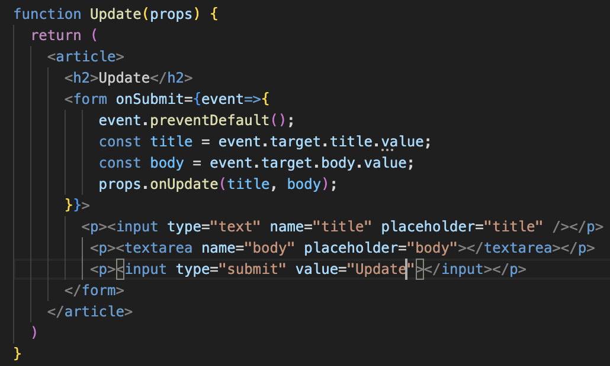. 
*🔼 Update 함수에 props 추가*. 
그러면 Update 컴포넌트를 사용하는 쪽에서도 사용할 때 onUpdate라는 props를 전달해야 겠죠? Update 컴포넌트를 정의한 부분에서 다음과 같이 title과 body를 전달받도록 코드를 작성합니다.  

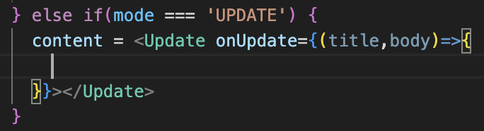  
*🔼 onUpdate props 전달*  
그 다음에 해야 할 일은 아주 중요한 부분입니다. 기본적으로 업데이틑 수정이기 때문에 폼에 기존 내용이 담겨 있어야 합니다. 그러면 Update 함수가 기존의 내용을 가지고 있으려면 뭘 해야 할까요? Update 컴포넌트에서 title과 body 값을 기본적으로 가지고 있어야 합니다.  

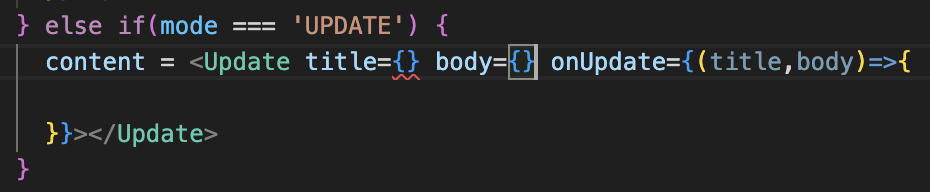. 
*🔼 Update 컴포넌트에서 title과 body를 가지고 있도록 코드 변경*. 
그러면 Update 컴포넌트의 title과 body는 어떻게 알아낼 수 있을까요? 앞서 mode가 READ일 때의 코드를 통해서 title과 body 값을 알아냈떤 거 기억나세요? 이를 이용하면 되겠네요.(콘솔에 로그를 출력하는 불필요한 코드는 지워주겠습니다.)  
```
} else if (mode=='READ') {
    let title, body = null;
    for(let i=0; i<topics.length; i++ ) {
        if(topics[i].id === id) {
            title=topics[i].title;
            body=topics[i].body;
        }
    }
}
```
mode가 READ일 때의 코드를 복사한 다음 Update 컴포넌트가 시작되기 전에 복사한 코드를 붙여 넣겠습니다. 그리고 title 값과 body 값을 각각 title, body props의 값으로 주겠습니다. 

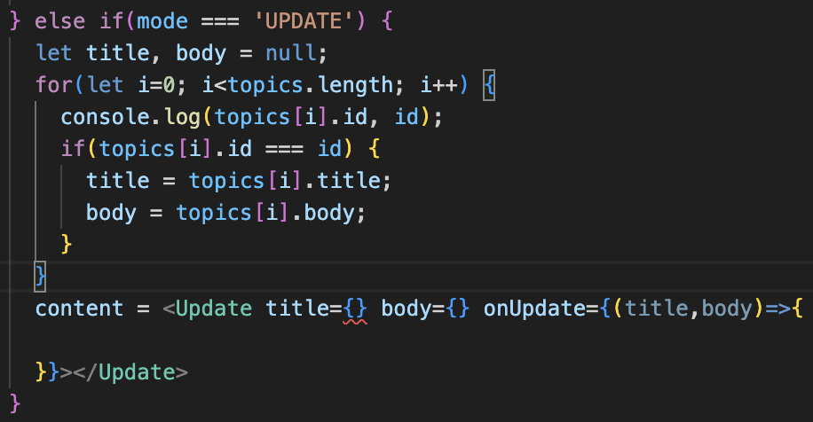. 
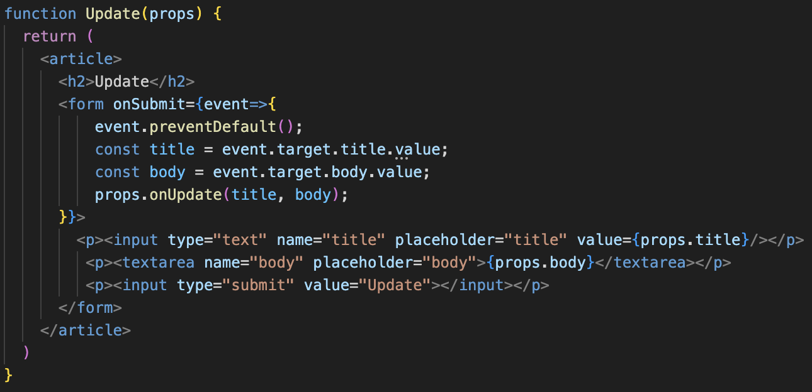. 
*🔼 mode가 READ일 때의 코드를 복사해서 붙여 넣고, title, body 전달*. 
그러면 Update 컴포넌트로 title 값과 body 값이 전달될 것이고, 이 값을 폼에 출력해 주겠습니다. props를 통해 전달된 값을 title의 value 값으로 지정하고, 내용 역시 body의 value 값으로 지정합니다. 그러면 폼에 제목과 본문이 나타나는 모습을 볼 수 있습니다.  
그런데 여기서 이상한 점이 있어요. 여기도 또 고비에요. 제목과 본문에 값을 입력해 보면 입력해도 아무런 변화가 없습니다. 리액트에서 props라고 하는 데이터는 사용자가 컴포넌트로 전달한 일종의 명령이죠? 비유하자면 엣날에 조선시대나 이런 왕이 있는 시대에 어명과 같은 것입니다. 즉, 다음 코드가 바로 사용자님께서 컴포넌트에 내린 어명입니다.
```
<Update title={title} body={body} onUpdate={(title, body)=>{

}}></Update>
```
즉, 폼에서 값을 입력하더라도 우리가 입력한 값이 props의 title 값을 바꾸지는 못합니다. 우리가 입력한 값과 별개로 props의 title은 여전히 html이고, 폼에 무엇을 입력하든 값이 바뀌지 않습니다. 그래서 이 props를 state로 바꿔야 합니다. props는 사용자(외부자)가 내부로 전달하는 값이고, state는 내부자가 사용하는 값입니다. props는 컴포넌트 내부에서 값을 변경할 수 없지만, state는 컴포넌트 안에서 얼마든지 바꿀 수 있습니다.  
따라서 Update 함수에서 title과 body state를 만들고, props로 전달된 title을 넣어줍니다. 즉, props를 state로 바꿔줍니다. 그리고 폼에 있던 props.title과 props.body도 방금 만든 state인 title, body로 바꿔줍니다.  

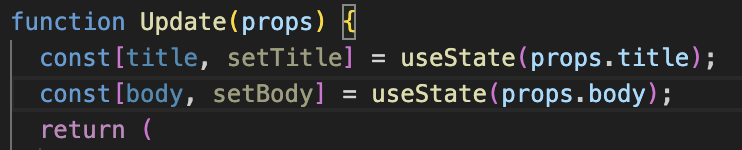  
*🔼 title과 body state 만들고 props를 state로 전환*  
그리고 다시 한번 폼에 있는 값을 바꿔볼까요? 아직은 값이 바뀌지 않습니다. 폼에 값을 입력하더라도 폼에 연결된 state가 바뀌지 않기 때문입니다. 어떻게 해야 할까요? 조금 어렵다고 느껴질 수 있는데, &lt;input&gt; 태그에 onChange 이벤트를 추가합니다. onChange 이벤트는 HTML의 onChange와는 다르게 동작합니다. HTML의 onChange는 값이 바뀌거나 마우스 포인터가 바깥쪽으로 빠져나갈 때 호출되는데, 리액트에서는 값을 입력할 때마다 값이 호출됩니다. 다음과 같이 onChange 이벤트에 event를 출력하는 로그를 추가해보겠습니다. 우리가 필요한건 값을 입력했을 때 입력한값이 무엇인지가 필요합니다. 이벤트 함수 안에서 트리거한 태그를 찾는건 target이고, 그 target의 값은 value이므로 다음과 같이 입력하고 실행해보겠습니다.  

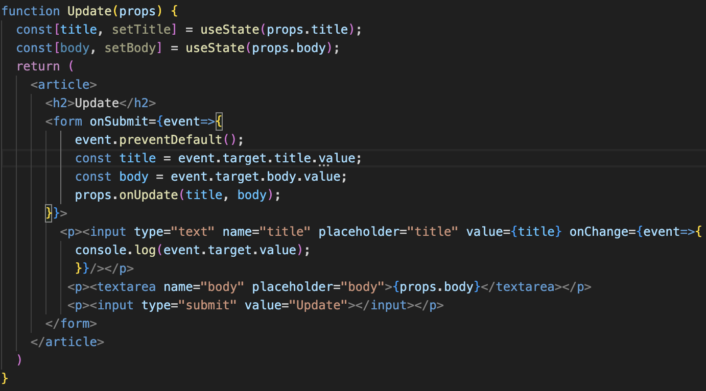.  
*🔼 onChange 이벤트를 추가하고 로그 출력*.  
Update 페이지의 폼에서 글자를 입력해보면 콘솔에 다음과 같이 입력한 마지막 값이 출력되는 모습을 볼 수 있습니다.  

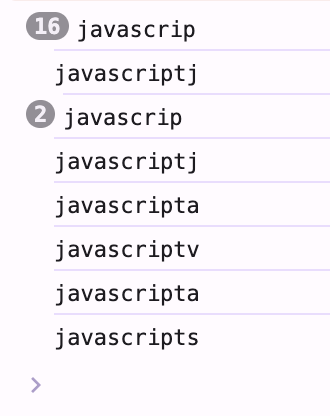  
*🔼 폼에 입력한 글자 중 마지막 글자를 로그로 출력*  
이제 우리가 해야 할 일은 event.target.value로 획득한 값을 새로운 state로 바꿔줘야 합니다. setTitle을 이용해 우리가 알아낸 가장 최근에 변경된 값을 새로운 title값으로 바꿔줍니다.  

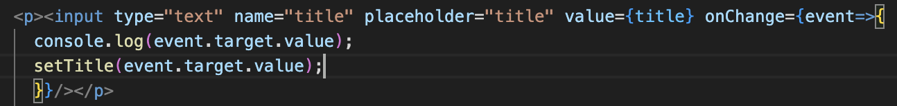  
*🔼 setTitle을 이용해 변경된 값을 새로운 title로 설정*  
다시 실행해보면 입력한 값이 잘 출력되는 모습을 볼 수 있습니다.
다시 정리해보면 먼저 props로 들어온 title을 state로 변경했습니다.
```
const [title, setTitle] = useState(props.title);
```
그리고 그 state를 &lt;input&gt; 태그의 value 값으로 지정했습니다.
```
<p><input type="text" name="title" placeholder="title" value={title} /></p>
```
state는 컴포넌트 안에서 변경할 수 있으므로 onChange에서 키보드를 입력할 때마다 setTitle을 이용해 새로운 값으로 지정했습니다. 그러면 새로운 값을 입력할 때마다 title의 값이 바뀌고 컴포넌트가 다시 렌더링 되면서 새로운 값이 value로 들어오는 과정이 반복되는 것입니다.
```
<p><input type="text" name="title" placehoder="title" value={title} onChange={event=>{
    setTitle(event.target.value);
}}/></p>
```
이번에는 본문 내용도 값을 입력하면 바뀌도록 수정해보겠습니다. &lt;textarea&gt; 태그에 onChange 이벤트를 추가하고 setBody를 이용해 body 값을 변경합니다.