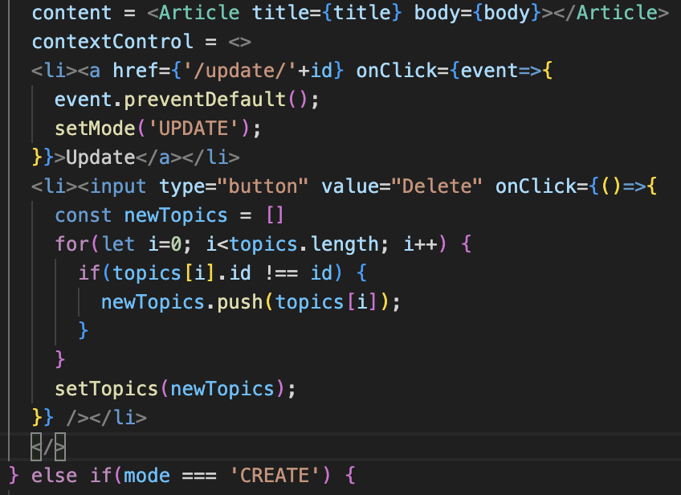
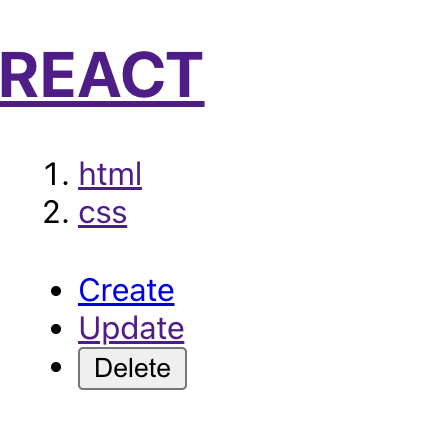
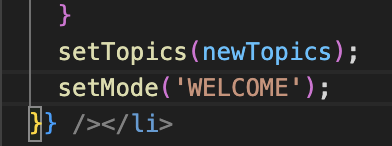
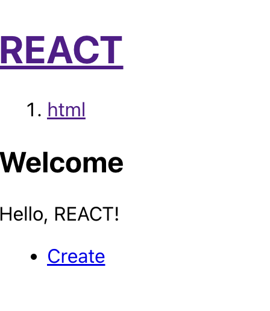

# Delete  
DELETE 기능을 구현하기 위해 Update 링크 아래에 DELETE 버튼을 만들 것입니다. CREATE나 UPDATE 기능은 특정 페이지로 이동하기 때문에 링크 형태로 해도 괜찮지만, DELETE 기능은 누르자마자 삭제할 것이기 떄문에 링크를 사용하면 안되고 버튼을 사용할 것입니다.  
DELETE 버튼은 contextControl이라는 변수가 READ로 들어갔을 때 보여지는 UI이므로 contextControl에 DELETE 버튼을 추가하겠습니다. 기존의 contextControl을 보면 &lt;li&gt; 태그가 있고, 또 하나의 &lt;li&gt; 태그를 추가해야 하는데, 리액트에서 태그를 다룰 때는 하나의 태그안에 들어 있어야 합니다.
```
contextControl = <li><a href={'/update/' + id} onClick={event=>{
    event.preventDefault();
    setMode('UPDATE');
}}>Update</a></li>
```
따라서 &lt;&gt;와 같이 제목이 없는 태그를 사용해 묶어줍니다. &lt;&gt; 태그는 여러 개의 태그를 묶는 용도로 활용하는 빈 태그라고 생각해주세요. &lt;&gt; 태그를 사용하면 실제 HTML 코드 으로는 어떤 태그로 존재하지 않게 됩니다.
```
contextControl = <>
 <li><a href={'/update/' + id} onClick={event=>{
    event.preventDefault();
    setMode('UPDATE');
 }}>Update</a></li>
 </>
 ```
그다음 &lt;&gt; 태그 안에 &lt;li&gt; 태그를 추가하고, &lt;li&gt; 태그 안에 type이 button인 &lt;input&gt; 태그를 추가해 버튼을 추가합니다. 이 버튼의 value는 Delete로 하고, 클릭했을 때의 처리를 위해 onClick 이벤트를 추가하겠습니다.
```
contextControl = <>
 <li><a href={'/update/' + id} onClick={event=>{
    event.preventDefault();
    setMode('UPDATE');
 }}>Update</a></li>
 <li><input type="button" value="Delete" onClick={()=>{

 }} /></li>
 </>
 ```
 button 타입은 특별히 기본적인 동작이 없기 때문에 event.preventdefault() 함수는 호출하지 않아도 괜찮습니다. 또한 경고창 같은 걸 띄운 후에 삭제할 수도 있겠지만, 그냥 바로 삭제하겠습니다. 삭제할 대상은 topics의 데이터입니다. 우선 newTopics라는 빈 배열을 만들겠습니다.
 ```
 const newTopics=[]
 ```
 그리고 for 문을 이용해 i가 0일 때부터 topics의 길이만큼 반복하면서 topics의 id와 현재 선택된 id가 같지 않다면 newTopics의 배열에 추가합니다. 즉, id가 일치하지 않는 글만 새로운 배열에 담아줍니다.
 ```
 for(let i=0; i<topics.length i++>) {
    if(topics[i].id !== id) {
        newTopics.push(topics[i]);
    }
 }
 ```
 newTopics는 기존에 있던 topics 배열이 아닌 빈 배열입니다. 그리고 삭제하고자 하는 글을 제외한 나머지 글이 담긴 배열이 됐습니다. 그리고 이 newTopics를 setTopics로 전달해 topics를 변경합니다.
 ```
 setTopics(newTopics);
 ```
 지금까지의 코드를 정리하면 다음과 같습니다.  

   
 *🔼 글 삭제하기*  

   
 *🔼 Delete 버튼을 누르면 삭제되는 글*  
 글을 삭제했기 떄문에 글의 상세 페이지로 이동할 수 없습니다. 따라서 WELCOME 페이지로 이동할 수 있또록 mode를 WELCOME으로 설정하겠습니다.  

   
 *🔼 글 삭제후 WELCOME 페이지로 이동*  
 이제 DELETE 버튼을 클릭하면 글이 삭제되고, WELCOME 페이지로 이동하는 모습을 볼 수 있습니다.  

   
 *🔼 Delete 버튼을 누르면 글이 삭제되고, WELCOME 페이지로 이동*  
