# REACT RUTTER DOM
이번에는 새로운 프로젝트를 만들고 여러 개의 페이지로 이뤄진 애플리케이션을 만들 예정입니다. 리액트를 이용해 여러 개의 페이지로 이뤄진 애플리케이션을 저암ㄹ 쉽게 만드는데 도움을 주는 react-router-dom을 다루어 볼거에요.

실습 준비
```
$ npx create-react-app react-router-dom-example
```
그리고 다음 명령어로 앞서 생서한 폴더로 이동합니다.
```
$ cd react-router-dom-example
```
그리고 다음 명령어로 애플리케이션을 실행합니다.
```
$ npm run start
```
먼저 create-react-app에서 만든 코드 중 필요 없는 부분은 걷어내겠습니다. index.css의 모든 내용을 삭제합니다.  
그리고 index.js에서 필요없는 내용을 삭제하고 App 컴포넌트를 직접 구현하겠습니다.

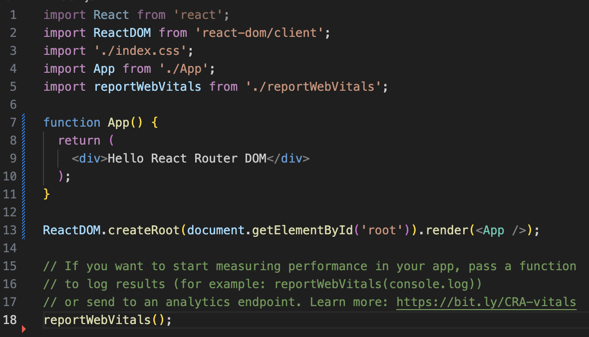  
*🔼 불필요한 코드 제거 및 App 컴포넌트 구현*  
우선 첫 번째 페이지의 App이라는 컴포넌트 안에서 사용할 3개의 컴포넌트를 만들겠습니다.  

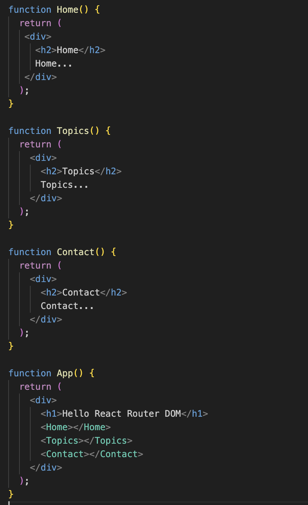  
*🔼 App 컴포넌트에서 사용할 3개의 컴포넌트 만들기*  
보다시피 Home, Topics, Contact 컴포넌트를 만들고 App 컴포넌트에 추가헀습니다.  
react-router-dom은 여러 페이지로 이뤄진 애플리케이션에서 진정한 가치를 발휘합니다. 그래서 여러개의 컴포넌트롤 생성해봤습니다. 코드를 저장하고 결과를 보면 다음 페이지의 그림 2-1과 같은 애플리케이션이 만들어집니다.
```
$ npm start
```
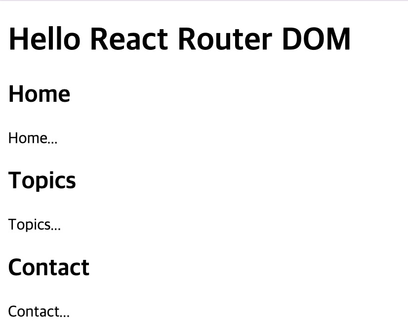  
*🔼 컴포넌트 여러개가 출력되는 애플리케이션*  

# Router  
먼저 가장 중요한 BrowserRouter를 살펴보겠습니다. BrowserRouter를 사용하려면 먼저 임포트해야 합니다.
```
import { BrowserRouter, Route, Routes} from 'react-router-dom';
```
이렇게 하면 BrowserRouter를 가져올 수 있는데, 이 BrowserRouter는 리액트 라우터의 도움을 받고 싶은 컴포넌트의 최상위 컴포넌트를 감싸는 래퍼 컴포넌트입니다. 현재 최상위 컴포넌트는 App 컴포넌트이므로 다음과 같이 BrowserRouter라는 컴포넌트로 감싸면 됩니다.

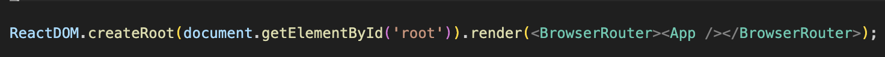  
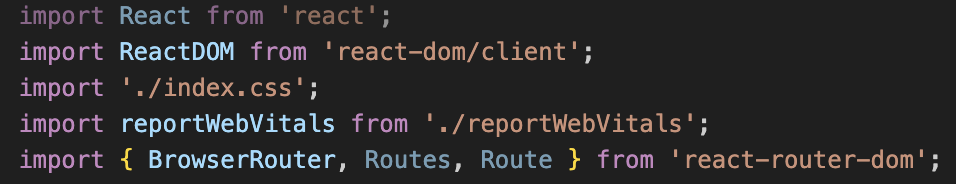  
*🔼 BrowserRouter를 임포트하고 최상위 컴포넌트 감싸기*  
이제 App 컴포넌트가  브라우저 라우터를 사용할 수 있는 상태가 됩니다. 그러면 라우팅의 가장 본질적인 작업으로 URL에 따라 적당한 컴포넌트가 App 컴포넌트에 위치하게 해보겠습니다.  

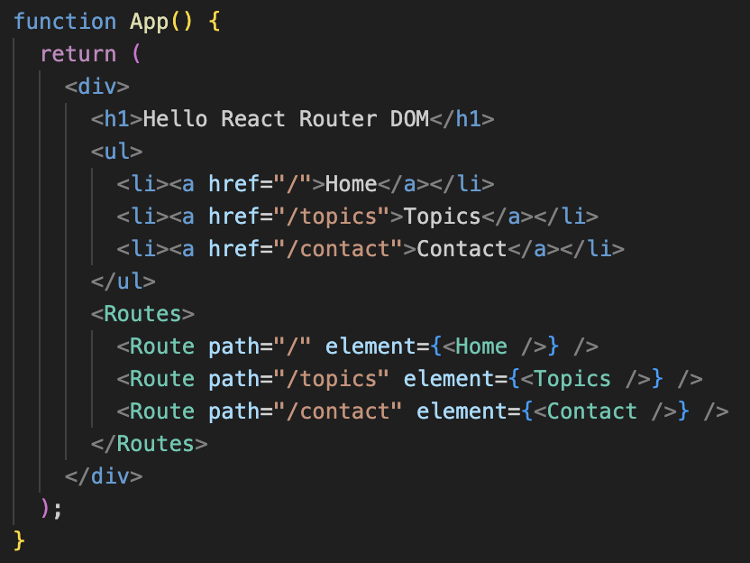  
*🔼 URL에 따라 적당한 컴포넌트가 App 컴포넌트에 위치하게 설정*  
Home, Topic, Contact 컴포넌트를 URL에 따라 달라지게 구현하고 싶습니다. 그렇게 하기 위해 세 개의 Route 컴포넌트를 추가하고, Route 컴포넌트를 Routes 컴포넌트로 감쌉니다. 각 Route 컴포넌트는 path 값을 가지고 있고, 각 path에 맞는 컴포넌트가 element prop의 값으로 지정돼 있습니다. 이제 URL이 달라지면 path가 일치하는 컴포넌트가 렌더링됩니다. 사용자가 이 웹사이트에 아무런 path도 지정하지 않고 들어왔을 때는 홈 컴포넌트를 사용자에게 보여주고, 사용자가 /topics라는 URL로 들어오면 Topics 컴포넌트를 보여주고 싶습니다. 그리고 /contact 주소로 들어오면 Contact 컴포넌트를 사용자에게 라우팅하도록 다음과 같이 path를 지정합니다.  
```
<Routes>
    <Route path="/" element={<Home />} />
    <Route path="/topics" element={<Topics />} />
    <Route path="/contact" element={<Contact />} />
</Routes>
```
이 링크들은 페이지 전환을 쉽게 해주기 위해 만든 UI입니다. 코드를 저장하고 결과 화면을 보면 그림과 같이 표시됩니다.  

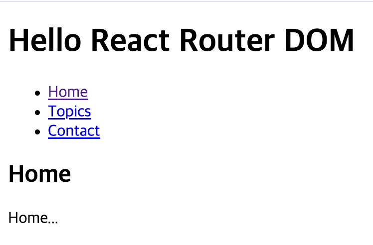  
*🔼 라우터와 링크를 추가한 화면*  
여기서 'Home'을 누르면 Home 컴포넌트를 라우팅합니다. 여기서 'Topics'와 'Contact'를 누르면 각각 Topics 컴포넌트와 Contact 컴포넌트를 라우팅합니다.  

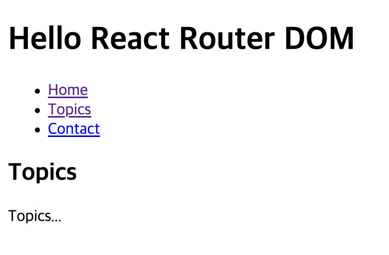  
*🔼 'topics'를 클릭했을 때 나타나는 화면*  

그럼 사용자가 존재하지 않는 페이지로 접근했을 때 NotFound 같은 페이지를 보여주려면 어떻게 구현하면 될까요?
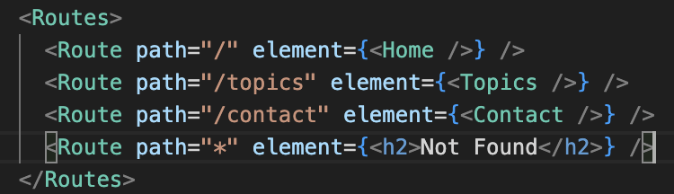  
*🔼 사용자가 존재하지 않는 페이지로 접근했을 때 Not Found 보여주기*  
위 코드와 같이 구현하면 /으로 접근했을 때는 Home 컴포넌트가 출력되고, 없는 주소로 접근한 경우에는 Not Found가 출력됩니다.  

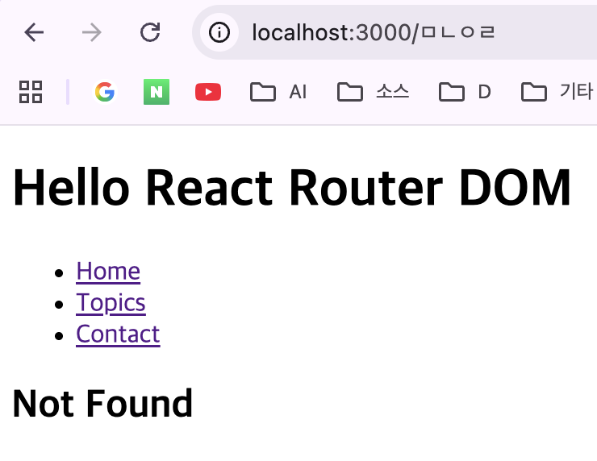  
*🔼 /ㅁㄴㅇㄹ로 접근했을 때의 결과 화면*  

# Link
이번에는 Link라는 컴포넌트에 대해 알아보겠습니다. 단일 페이지 애플리케이션(Single Page Application)을 만들 때 중요한 점은 페이지가 리로드되지 않고 동적으로 가져오는 데이터는 코드를 작성해서 만들거나 Ajax 같은 기술을 이용해 비동기적으로 데이터를 가져와서 페이지를 만드는 것입니다.  
지금은 애플리케이션 상단의 링크를 클릭할 때마다 페이지가 새로 로딩됩니다. Link 컴포넌트는 페이지가 리로드되지 않게 자동으로 구현하는 컴포넌트입니다. 앞에서 만든 &lt;a&gt; 태그를 Link 컴포넌트로 교체해보겠습니다.  

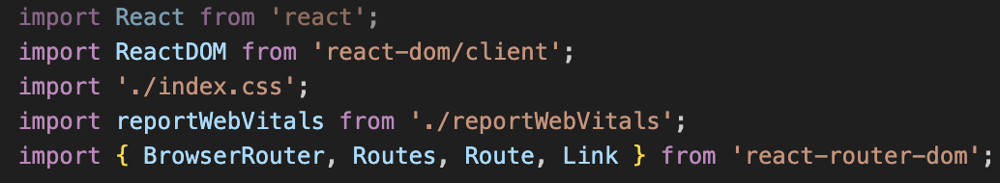  
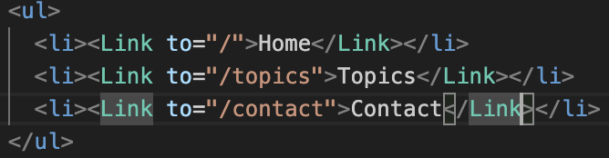  
*🔼 &lt;a&gt; 태그를 Link 컴포넌트로 교체*  
여기서는 href 속성 대신 to를 사용해야 합니다. 그러고 나서 실행해보면 페이지가 바뀌지 않는 것을 볼 수 잇습니다. 이것을 직접 구현하려면 상당히 복잡하니다. 고맙게도 그러한 구현을 Link 컴포넌트가 대신해주고 있습니다.  
상단의 링크를 클릭하면 페이지가 리로드되지는 않지만 이것이 제대로 동작하려면 애플리케이션의 웹서버 설정이 사용자가 어떤 패스로 들어와도 동일한 웹 페이지를 서비스할 수 있어야합니다. 그렇게 되지 않는 경우에는 난처한 일이 생길 수가 있습니다. 그런 경우를 위해 준비한 Router가 HashRouter입니다. HashRouter를 한번 사용해보겠습니다. 지금까지 사용했던 BrowserRouter를 모두 HashRouter로 변경하고 결과를 화인해보겠습니다.  

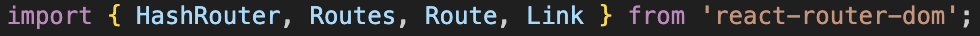  
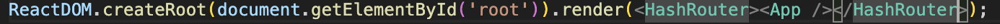  
*🔼 BrowserRouter를 HashRouter로 교체*  

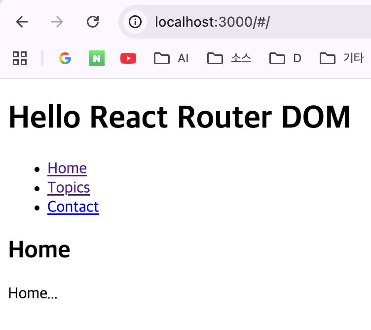  
*🔼 HashRouter 사용*  
주소창이 어떻게 바뀌는지 보면 BrowserRouter를 사용했을 때와는 다르게 URL에 #가 끼어들어간 것을 볼 수 있습니다. #가 붙어있으면 뒤의 내용은 북마크라는 뜻입니다. 웹 서버는 # 문자 뒷부분의 주소를 무시합니다. 하지만 자바스크립트를 이용해 # 뒷부분의 내용을 알 수 있기 때문에 react-couter-dom은 URL을 읽어서 적절한 컴포넌트로 라우팅해 줄 수 있습니다. 하지만 #가 들어가기 때문에 깔끔하지는 않아 보입니다. 웹 서버 설정에 따라 어떤 패스로 들어오든 루트 페이지에 있는 HTML 파일을 서비스할 수 있다면 BrowserRouter를 사용하고, 그렇지 않다면 HashRouter를 사용하면 됩니다.  

# NavLink
이번에는 NavLink에 대해 알아보겠습니다. NavLink는 Link와 유사한데 기능이 조금 더 부가된 것이라고 보면 됩니다. 지금까지 사용했던 Link 컴포넌트를 NavLink 컴포넌트로 변경해보겠습니다.  

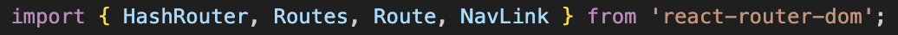  
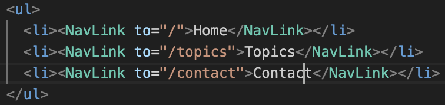  
*🔼 Link 컴포넌트를 NavLink 컴포넌트로 교체*  
결과를 보면 똑같아 보이지만 크롬 개발자 도구로 해당 요소를 보면 다른 부분을 확인할 수 있습니다.  
Link 컴포넌트를 사용했을 때와는 달리 class="active"라는 속성이 생겼습니다. class="active" 속성을 이용하면 사용자가 현재 자신이 어떤 페이지에 위치하고 있는지 직관적으로 알 수 있게 네비게이션에 사용자가 위치한 곳을 표시해줄 수 있습니다. index.css를 열어서 다음과 같이 작성합니다.  

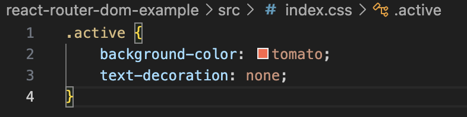  
*🔼 내비게이션에 사용자가 위치한 곳을 표시*  
그러면 다음과 같이 사용자가 어디에 있는지를 알려주는, 별것 아닌 것 같지만 신박한 기능이 바로 NavLink가 제공하는 기능입니다.  

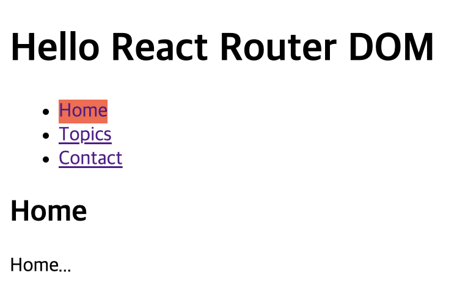  
*🔼 사용자가 클릭한 링크가 표시된다.*  
